# KAKAO-AI-study
For studying Kakao Enterprises' AI lecture <br/>
I'll summarize the useful theoretical contents and knowledge about my additional self studies here::
<hr/>

# Remind and More
Because it is literally "remind" and "more", It doesn't have every description about python.

## Famous quotes in programming
> Don't Reinvent The Wheel, Unless You Plan on Learning More About Wheels

It means don't reinvent existing codes. Just use made codes by the greatest people.
<hr/>

## IDE
__I__ ntegrated <br/>
__D__ evelopment <br/>
__E__ nvironment<br/>
__IDE__ is a tool to help programming.
<hr/>

## Libraries about DL/ML

- __Scikit Learn__ : traditional ML
- __tensorflow__ : DL
<hr/>

## R vs Python

- R
  - _Strength_ : Faster visualization than python.(ggplot), Has advanced statistical techniques
  - _Weakness_ : Almost impossible to apply prediction model to web or app. There is a tool named 'shiny' to visualize in web, but restricted usage only. 
- Python : Can easily apply the model to web or app using 'django'
<hr/>

## Useful methods
- ```python
   dir(something)
  ```
  Show usable methods or properties with something
- ```python
   help(something)
  ```
  Show details about something. <br/>For example parameters in methods
<hr/>

## Python indexing
```python
sample = "Deep Learning"
print(sample[2:5])  # 'ep '
print(sample[4:1:-1])  # ' pe'
```
Main structure is like this sth[start \: end \: step]
<hr/>

## String formatting
```python
print("%d is greater than %d" % (10, 20))  # % operator
print("{} is greater than {}".format(10, 20))  # format method
print(f"{10} is greater than {20}")  # f-string
```
These ways result same but '% operator' is so old method and not efficient due to its complexity.<br/>
Second methods makes it easier than '% operator' because it doesn't need types.<br/>
Lastly, 'f-string' is the best way to format string I think. In effect, It is the fastest way for formatting. Above all, It looks so fancy!!<br/>
<hr/>

## Advanced string formatting
```python
print(f"{'hello':_>10}")  # _____hello
print(f"{'hello':_<10}")  # hello_____
print(f"{'hello':_^10}")  # __hello___
```
No more additional description needed.<br/>
<hr/>

## Style guides

- snake_case : python, etc
- camelCase : java, etc
- PascalCase : class names
- kebab-case : css, etc

Python has style guide called PEP8(Python Enhancement Proposal) and it directs to follow some pythonic style guides.<br/>
[link to PEP8](https://peps.python.org/pep-0008/)
<hr/>

## Counter
```python
from collections import Counter
print(Counter([1, 2, 2, 3, 3, 3]))  # Counter({3: 3, 2: 2, 1: 1}) 
```
This is a useful method to count elements.<br/>
It returns like 'Counter({3: 3, 2: 2, 1: 1})'<br/>
As you can see, It is a Counter instance inherited dictionary.<br/>
So we can access values by using a key.<br/>
Keys mean elements in the container variable, and values mean the number of that element in there.<br/>
<hr/>

## File I/O
- python internal method
```python
file = open("file_path/name", "mode", encodeing="encoding_method")
data = ["interesting", "Python", "language"]
file.write(", ".join(data))
file.close()
```
There is more parameters in open method, but we usually use these thr/ee options.<br/>
And I'll use pandas library to do file i/o in the future.<br/>
I mean it's just an example to show how to do this without library.<br/>
Here's some more information.<br/>

1. file path : It covers file path, file name, extensions.
   - .csv : comma-separated values
   - .json(Javascript Object Notation), .xml, .yaml : data expression types

2. mode : we have thr/ee main options.
   - 'r' : read option
   - 'w' : write option
   - 'a' : write option too

There's a difference between __w__ and __a__.<br/>
__w__ can write in any text based files, but It doesn't remain any existing datas. So we must use this carefully.<br/>
But __a__ can remain existing datas. Literally it adds data at existing datas.

3. encoding options : If you use Korean, there's thr/ee options.
   - utf-8
   - cp949
   - euc-kr

__utf-8__ is the most renowned option, but before using it people used __cp949__ and __euc-kr__.<br/>
In the past Microsoft made these encoding types to use Korean.

+ More efficient way to use open
```python
with open("file_path/name", 'mode', encodeing='encoding_method') as file:
    data = ["interesting", "Python", "language"]
    file.write(", ".join(data))
```
It prevents issues when we forgot calling file.close()<br/>
Following is some descriptions about __with__.
<hr/>

## with keyword
```python
with open("file_path/name", 'mode', encodeing='encoding_method') as file:
    data = ["interesting", "Python", "language"]
    file.write(", ".join(data))
```
__with__ keyword allow us designing the object cycle(construction, use, destruction)
<hr/>

## Class

### Inheritance
```python
class ParentClass:
  def parent_class(self):
  print("parent class")
 
  
class ChildClass(ParentClass): 
  def child_class(self):
    print("child class")
```
In line 6, ChildClass was inherited ParentClass.<br/>
<br/>
### Constructor, Destructor
```python
class MyClass:
    def __init__(self, s):  # Constructor
        print(f"constructor executed, {s}")
        self.datas = ["name", "age", "sex"]

    def __del__(self):  # Destructor
        print("destructor executed")


a = MyClass('t')
```
The constructor will be called right after the object is created.<br/>
The destructor will be called right before the object is deleted.<br/>
<br/>
### Instance method, Class method, Static method
```python
def data(self):  # instance method
  print(self.datas)

@classmethod
def data_class_method(cls):
  print("class method")

@staticmethod
def data_static_method():
  print("static method")
```
Instance methods can be accessed by an object like this.
```python
instance.method()
```
Class methods can be accessed by the class name like this.
```python
ClassName.method()
```
Static methods can be accessed both object and class name like this.
```python
instance.staticmethod()
ClassName.staticmethod()
```
Static methods are just a function but when we think that it is related with specific class, we can wrap it together and use.<br/>
These class, static methods can be made by using __decorator__.<br/>
<br/>

### Decorator

Decorator is usually used for making __class method__, __static method__, __abstract class__, etc.<br/>
These are already existing, so we can use it anytime.<br/>
But when if we want to make our own decorator, follow these codes.<br/>
```python
def mydeco(func):
    def wrapper():
        print(f"Decorator executed, and execute {func.__name__}")
        func()
    return wrapper


@mydeco
def sample_func():
    print("sample function")
```
`mydeco()` operates as a decorator.<br/>
Simply get function as a parameter, wrap it, and return it.<br/>
<br/>

### Overriding tostring method (+Overloading)
```python
def __str__(self):  # overriding tostring method
    res = ''
    for idx, elem in enumerate(self.datas):
        res += f"{idx} : {elem}\n" if idx < len(self.datas) - 1 else f"{idx} : {elem}"
    return res
```
In python every class has there's `__str__` method internally.<br/>
So we can override it instead of tostring method as in many other languages.<br/>
And the __overriding__ means rewrite existing functions or methods. So we can make those more fit to our uses.<br/>
__Overloading__ is a totally different thing.<br/>
Whereas __overriding__ means rewriting the parent class's method, __overloading__ can give _**polymorphism**_ to the method we made.<br/>
In other words, we can make methods to operate differently by the type or the number of parameters.<br/>
But python doesn't officially offer __overloading__, so we should use tricks.<br/>
<hr/>

## Lambda Function
```python
f_l = lambda x: x ** 2  # lambda function, anonymous function
print(f_l(2))
```
__lambda function__ is the simplest way to make function.<br/>
It can receive any number of arguments, but it can only have one expression.<br/>
### Actual usage
```python
def sample_f(l, func):  # (list, lambda function)
    l = [func(item) for item in l]
    print(l)
    
    
sample_f([1, 2, 3], lambda x: x ** 2)
```
<hr/>

## Module, Library, Package
- __module__ : single file
- __library__, __package__ : multiple files

Every language has a preferred term to call this, but it all means same.
<hr/>

## PIP
__pip__(Package Installer for Python) is literally a package installation tool.<br/>
Followings are commonly used commands.
- `pip install package_name` : install package
- `pip uninstall package_name` : uninstall package
- `pip install --upgrade pip` : upgrade pip
- `pip list` : show lists of installed packages

### Advanced usage
- `pip check` : check if there is any collision or uninstalled required libraries
- `pip show package_name` : show information about a library. Due to the version differences, we have to check versions using this command before uninstall libraries.
- `pip download package_name` : download library as an installation file(.whl) so that it can be installed from a place where the Internet is not accessible.
- `pip install package_name.whl` : install .whl file
- `pip freeze > filename.txt` : save lists of installed libraries as a text file. (usually use requirements.txt as a filename. Similar with package.json in js)
- `pip install -r filename.txt` : install in batches
<hr/>

## Type hint
Although one of the python's strength is that it doesn't need to specify types, it can give type hints.
```python
def odd_or_even(num: int) -> str:
    result: str = "even" if num % 2 == 0 else "odd"
    return result
```
Simply use __':'__ to specify types.<br/>
And __'->'__ means a return type in functions.<br/>
If we use __'typing'__ library, we can also do these fantastic things.
```python
# dict
d: dict[str, int] = {
    '1': 1,
    '2': 2,
    '3': 3
}

# list
l: list[str] = ['hello', 'python']
l2: list[Union[str, int]] = [1, '1', 2, '2']

# optional
def foo(a: Optional[str] = None):
    return a if a else 'None'

# final
CONST_VAR: Final = 1000
```
It's not mandatory, the  but it will still increase our code qualities.<br/>
Check out the official document of __'typing'__. This library and additional library named __'type annotation'__ have already included in internal libraries from python version 3.5.<br/>
And there are also a type checking library named __'mypy'__. But some editors already have a plugin to do that. So check it out!
<hr/>

## Regular Expression

To check strings by matching patterns.<br/>
For example, if we want to get an email address, we can use this to make sure it is an email address.<br/>
Let's see a simple example item below.<br/>
```python
import re


str = 'apple is delicious, but it is red.'
a = '^[a-zA-Z0-9]+'  # one or more ('a', 'apple') 
b = '^[a-zA-Z0-9]*'  # zero or more ('', 'a', 'apple')
c = '^[a-zA-Z0-9]?'  # zero or one ('', 'a')
# ^ : starts with following patterns
re.match(a, str)
re.match(b, str)
re.match(c, str)

d = '[a-zA-Z0-9]+' 
re.findall(d, str)  # return all words that matches the pattern as a list.
```
It returns None type if it matches nothing.<br/>
For more information, check this web page.<br/>
[Regex(written in Korean)](http://pythonstudy.xyz/python/article/401-%EC%A0%95%EA%B7%9C-%ED%91%9C%ED%98%84%EC%8B%9D-Regex) <br/>
[advanced](https://hamait.tistory.com/342)
<hr/>

# Data processing
In this part I'll study about data processing using python.

## Data Types

- __structured data__ : spreadsheets, database
- __semi structured data__ : HTML, log, sensor data
- __unstructured data__ : image, video, sound
<hr/>

## Deep learning, Machine learning

- __Deep Learning__ 
- __Machine learning__ 

__DL__ doesn't need feature engineering. It is based on an artificial neural network. So it learns on its own just like a human. But it is not a proper description. No one knows how it exactly works.<br/>
It is usually used to process unstructured datas. So it preprocesses unstructured datas to transfer to structured datas.<br/>
__ML__ doesn't need neural network. It needs feature engineering to learn.<br/>
It is usually used to process structured datas.<br/>
<hr/>

## Ways to gather data

- __owned data__
- __unowned data__
- __public data & open data__

These are ways to gather datas.<br/>
__Owned data__ means literally my data. These are from my services. (Google Analytics, Elastic Stack, ELK Stack, Zeppelin, etc...)<br/>
__Unowned data__ is datas from other companies. (API, Web Scrapper, etc...)<br/>
__Public data & Open data__ is opened datas for anyone who wants to use it. Available via API or downloading. (Kaggle, etc...)
<hr/>

## Ways to handle missing datas

- Fill with a random value (not used)
- Fill with relative row's value. (datas from time flows)
- Calculate a representative value in that column(mean, median, etc...)
- Group all datas in that row according to another row's data, and calculate a representative value in that group.
If there is a vacant cell in height row, group with another row's value such as age. And get a representative value.
- Make the ML predict model with the other column's values, and predict.
- Remove that column, if there are vacant cells over specific rate. And it should be an irrelevant one.
<hr/>

## Model quantization
__Model quantization__ is a DL technique that express model parameters as lower bits.<br/>
It makes calculation and the model accessibility to the memory faster by making it simply. It results a faster prediction.<br/>
For example, in 32bit cpu it originally uses 32bits to express a number. But Model quantization makes it represented by 8 bits.
<hr/>

## Feature scaling(Normalization)
Sometimes we can have a data that has ruined scale of features.<br/>
When we use this data in ML, DL, and even a heatmap will not operate properly.<br/>
So we should do a __Feature scaling__.<br/>
These are some techniques.<br/>
- Min-Max Algorithm<br/>

This algorithm basically operates by setting the minimum value of one column as '0', and the maximum value as '1'.<br/>
Here's the formula to use this algorithm.<br/>

```math
newX = {oldX-min \over max-min}
```

Just pick one value in specific column, and do this.<br/>
__oldX__ is the original value, and __newX__ is the result of Min-Max Algorithm.<br/>
It may return some negative values. Then we can normalize each index by taking its relative absolute value or square value to the total.<br/>
Simply sum that column's absolute value, and divide each value to the total.<br/>

```math
df = {\lvert d_i \rvert \over \sum\limits_{i=1}^n \lvert d_i \rvert}
```

or<br/>

```math
df = {d_i^2 \over \sum\limits_{i=1}^n d_i^2}
```

[Min-Max Normalization Docs](https://people.revoledu.com/kardi/tutorial/Similarity/Normalization.html)
- Standardization<br/>

This algorithm basically operates like Min-Max. But the difference is it sets the mean value of one column as '0', and the standard deviation(std) as '1'.<br/>
And also here's the formula.<br/>

```math
newX = {oldX-mean \over std}
```

Many people use __Min-Max Algorithm__ because it is intuitive. But!!!! when if we use these in ML or DL, __Standardization__ will often get better model performances than __Min-Max Algorithm__. But not everytime.

We don't need to remember these formulas. When we use these in ML or DL, there's already existing method to do this job. So we just need to understand.

- Log

Log can make a large number into a small number of equal proportions.<br/>
And it can also be used in preprocessing(lower skewness, kurtosis) the data with large skewness or kurtosis.<br/>
As a result, increase the normality of each column, can get accurate values in analysis.<br/>
Just take the log for each value.<br/>
<hr/>

# Pandas

__pandas__ is a powerful data analysis, manipulation tool. From now on, I'm going to summarize this.<br/>

## Column, Row

- Row : Horizontal groups
- Column : Vertical Groups

For example here is 3X4 matrix.<br/>
>[[ 1 1 1 1 ]<br/>
  &nbsp;[ 2 2 2 2 ]&nbsp;&nbsp;&nbsp;&nbsp;&nbsp;&nbsp;&nbsp;&nbsp;&nbsp;3 X 4 matrix<br/>
  &nbsp;[ 3 3 3 3 ]]<br/>

There are 3 rows and 4 columns.
<hr/>

## Read file (excel file)
```python
import pandas as pd


data = pd.read_excel("PATH")
```
There are more methods which can get datas from files. (read_csv(), read_html(), read_json(), etc...)<br/>
__read_excel()__ needs one more additional library called __"xlrd"__ since it uses this internally.<br/>
__xlrd__ is usable when read or write Excel files in python.<br/>
<hr/>

## Pandas data types

- DataFrame
- Series

__pandas__ has two major data types.<br/>
DataFrame is like a matrix that has rows and columns, and Series is a 1-dimensional list with keys that consisted with one row or column.<br/>
So DataFrame is a collection of Series.
<hr/>

## Pandas major methods

- __set_index()__
```python
import pandas as pd
data = pd.read_excel("path")
print(data.set_index("item"))
```
In every dataframe, the first column is an index column.<br/>
__set_index()__ can set index column as a specific column.<br/>

- __head()__, __tail()__
```python
import pandas as pd
data = pd.read_excel("path")
print(data.head(10))
print(data.tail(10))
```
Can show only first, last few datas.

- __describe()__
```python
import pandas as pd
data = pd.read_excel("path")
print(data.describe())
```
Show us a description of datas. It has statistical values.<br/>
Same as descriptive statistics.<br/>
It contains count, mean, std(Standard Deviation), etc...<br/>
We must check out about the Median, the Mode, the Variance.<br/>

- __info()__
```python
import pandas as pd
data = pd.read_excel("path")
print(data.info())
```
Show information about dataframe.<br/>
Contains datatype, Non-Null Count, column.<br/>
> Non-Null == None == Null == NoneType == N/A, similar with Nan(Not A Number).<br/>
<hr/>

## Get series by row

### loc[]
```python
dataframe.loc[key]  # key(index) in index column
```
__loc[]__ is not a function, it's just a helper to show data. But it is not recommended. There's another way to get datas by row. So just check it out.

#### Get series as dataframe type
```python
dataframe.loc[[key]]
```
Simply wrap with '[]' once again.

#### Get two or more series as dataframe
```python
dataframe.loc[[key, key, ...]]
```
Just pass keys in list format.

#### Get series by specifying ranges.
```python
# dataframe.loc[row_key:row_key, column_key:column_key]
dataframe.loc[3:6, "key":"key"]
```
Just specify keys.<br/>
It can be also applied to column.<br/>
Numbers in row_key are not indexes, those are labels in the index_column.
If you want to access by using index, use `iloc[]`.
```python
# dataframe.iloc[row_key:row_key, column_key:column_key]
dataframe.iloc[3:6, 0:3]
```
It has same usage with `loc[]`.<br/>
Contrary to `loc[]`, `iloc[]` is memorable. It is often used.<br/>
And it's the only one circumstance that uses the index number in dataframes.<br/>
If you want to access by indexes, use `iloc[]`. Or use `loc[]` when if you want to access by labels.<br/>
These are different!!
If the dataframe is like this.
```python
id   name   age ...
 1    tom    21 ...
 2   tony    23 ...
 3  james    21 ...
```
And the codes are like this.
```python
df.loc[1:2]
df.iloc[1:2]
```
`loc[]` and `iloc[]` return different dataframe.<br/>
`loc[]` returns __tom__ and __tony's__ datas. Whereas `iloc[]` returns __tony's__ datas.
<hr/>

## Get series by column
```python
dataframe['key']
dataframe['key'][0]  # get one element
dataframe.loc[0]['key']  # same as above
dataframe[["key", "key", ...]]  # multiple columns
```
Same as the way to get datas in dictionary. And also accessible to one element using index.<br/>
And also able to get multiple columns.
<hr/>

## Usable methods in series

### .str.contains("str") 
```python
dataframe["key"].str.contains("string")
```
__.str__ converts the datas to string.<br/>
__.contains__ can check if the specific string is in datas converted as string. It returns Boolean type values.<br/>

```python
sum(dataframe["key"].str.contains("string"))
```
We can also get the number of datas that contains specific string.

### .endswith, .startswith, .lower, .upper, etc ...
```python
dataframe["key"].str.endswith("string")
dataframe["key"].str.startswith("string")
dataframe["key"].str.lower()
dataframe["key"].str.upper()
```
Some more methods available.<br/>
<hr/>

## Dataframe filtering
```python
dataframe[dataframe["key"].str.contains("string")]
```
We just learned that `.contains("string")` returns Boolean type values. So we can use it as a filter in dataframe. The usage is same as when we get one column. Just write this codes instead of a key, and we can get corresponding datas only.
<hr/>

## Advanced ways to handle dataframe.

### .apply()
```python
dataframe['new_column'] = dataframe['col_key'].apply(function)
```
__.apply()__ can literally apply a function to a column.<br/>
It can be used when we make a new column using existing columns' values.<br/>
Any function can be used. We can make a function using 'def' keyword like the way we use in usual, and apply. Or we can also use a lambda function on it.<br/>
Additionally, there will be a warning issue when we do this, but it doesn't matter just leave it. Or you can check it out and find useful ways.<br/>

### .pivot_table()
```python
pivot_df = pd.pivot_table(original_df, index="col_key", aggfunc=function)
```
Summarize datas based on a specific column.<br/>
It's like the pivot table in Excel.<br/>
In aggfunc(aggregation function) argument, we can set any function to aggregate the other columns' values. Usually use `nu.sum`, `np.mean`, `np.min`, `np.max` on it. But we can also make our own function!<br/>
LIke this!!
```python
def my_sum(x):
    res = 0
    for item in x:  # Boolean type value
        res = res + 1 if item else res
    return res


pivot_df = pd.pivot_table(df, index="col_key", aggfunc=my_sum)
```
And one more important information is that the column will be removed which can not be aggregated like 'names'.
<hr/>

### Drop row or column
```python
df.drop(['row_keys', ...], inplace=True)  # drop rows
df.drop(['col_keys', ...], axis=1, inplace=True)  # drop columns
```
Use `drop()` method to drop rows or columns. Or we can also use the `del` keyword like a dictionary.<br/>
Using the `axis` parameter, we can drop columns also. Default is 0 that means rows and 1 means columns.<br/>
And `inplace` parameter, we can see this parameter in many situation. If we set this as True, methods will overwrite the original variable. Else will return processed value.<br/>
<hr/>

### Sort
```python
df.sort_values(by='col_keys', inplace=True, ascending=False)
```
It's intuitive. We can sort in reverse order by setting `ascending` as False.
<hr/>

### Deep copying dataframe
```python
# shallow copy
new_df = df
# deep copy
new_df = df.copy()  # deep=True as default
```
'Shallow copy' copies only the address value in memory.<br/>
'Deep copy' copies the whole object.<br/>
<hr/>

### loc[], iloc[], at[], iat[]
```python
# loc[]
df.loc['row_key':'row_key', 'col_key':'col_key']  # print
df.loc['row_key':'row_key', 'col_key':'col_key'] = 100  # update

# iloc[]
df.iloc[row_idx:row_idx, col_idx:col_idx]  # print
df.iloc[row_idx:row_idx, col_idx:col_idx] = 100  # update 

# at[]  -> recommended
df.at['row_key', 'col_key']  # print
df.at['row_key', 'col_key'] = 100  # update

# iat[]
df.iat[row_idx, col_idx]  # print
df.iat[row_idx, col_idx] = 100  # update 
```
There are some differences among `loc[]`, `iloc[]`, `at[]`, `iat[]`.<br/>
Typically `(i)at[]` is faster than `(i)loc[]`. So many use this method.<br/>
However `(i)at[]` can't access multiple elements, whereas`(i)loc[]` can.
<hr/>

### Masking
```python
print(df['col_key'] > 7)
df[df['col_key'] > 7] = 0

print(df[['col_key']] > 7)
df[df[['col_key']] > 7] = 0
```
These are the masking technique.<br/>
These look similar but return totally different type.<br/>
First one returns a set of datas in index column and bool datas of each index as series.<br/>
And we can set it as a key to get and update datas.<br/>
So if we set value on that, all datas at those indexes in returned series are updated by that value.<br/>
Because it means just specific indexes are true and the others are False like this!!<br/>
```python
print(df['col_key'] > 7)
----------------------------------
index
    0 True
    1 False
    2 False
    3 True
```
It returns a series. Therefore, When we use this as a key and print, it will show only the rows that have True value.
So when if we update dataframe as 0 using this, all datas in '0' and '3' rows will be updated as 0.<br/>
Additionally, we can apply 'and', 'or', 'not' operations on that so that we can apply multiple conditions.<br/>
```python
print(df[ (df['col_key'] > 7) & (df['col_key'] > 2000) ])
print(df[ (df['col_key'] > 7) | (df['col_key'] > 2000) ])
print(df[ ~(df['col_key'] < 5) ])
```
However, second one is different.<br/>
It returns a dataframe like this.<br/>
```python
print(df[['col_key']] > 7)
----------------------------------
      column
index 
    0   True
    1  False
    2  False
    3   True
```
When we use this as a key and print, it will show the whole dataframe fill with NaN except for the datas that have True value. And they will be printed as their own values like this.
```python
      column  column2 ...
index 
    0      8      NaN
    1    NaN      NaN
    2    Nan      NaN
    3     10      Nan
```
So If we update using this, it will only change specific datas.
<hr/>

### Merge

#### a.join(b)
It works well with unsorted dataframes, But 'a', 'b' dataframes' index column should be same.

#### pd.merge(a, b, left_on='', right_on='', how='')
Should set detailed props, and also works well with unsorted dataframe, but it doesn't matter when if two dataframes have not same indexes.<br/>
`left_on` means a's index column name, and `right_on` means b's index column name.<br/>
`how` means the way to merge two dataframes. It has inner, left, right, full outer like join in SQL.<br/>

#### pd.concat([a, b], axis=)
It doesn't follow the index columns, can be done by rows or columns. Often used when adding new rows.
<hr/>

### .quantile()
```python
df.quantile()
```
It returns 0%, 25%, 50%, 75%, 100% of Quaternary values.<br/>
Pass float value 0, 0.25, 0.5, 0.75, 1.<br/>
`df.quantile(0.5)` is same as `df.median()`.<br/>
<hr/>

### A.div()
```python
target_df = target_df.div(source_df['col_key'], axis=0)
```
It divides target_df's values by source_df's specific columns values.<br/>
Default axis is 1, so if we want to divide by column, we should set axis as 0.<br/>
<hr/>

## Seaborn
__Seaborn__ is a visualization tool.<br/>
It operates based on __matplotlib__.<br/>

### font setting
If we have Korean in our datas, Seaborn cannot display Korean well.<br/>
So we have to set a Korean font.<br/>
Here's the code.<br/>
```python
plt.rc('font', family='font_name')  # font setting (Korean)
```
Done!
In addition, __rc__ means 'run configure'.<br/>
If you want to know available fonts list, run this code.<br/>
```python
from matplotlib import font_manager as fm

for font in fm.fontManager.ttflist:
    print(font)
```
It'll show you fonts list.<br/>
For more information, check this website. (It's written in Korean though..)<br/>
[korean font setting](https://deepblancs-it-study.tistory.com/54)
<hr/>

### heatmap
```python
sns.heatmap(df.sort_values(by="col_key", ascending=False), cmap="rocket_r", annot=True, fmt="f", linewidth=.5)
```
It can show a heatmap easily.<br/>
__cmap__ is a color map. So we can set a color map to show.
If __annot__ is True, the value of each index will appear in the heatmap.<br/>
__fmt__ means a format to annotate the value.<br/>
And there are some more props. Check out the docs.<br/>
<hr/>

## folium(map visualization library)
__folium__ is a map visualization library.

To use this we have to pass GEOJSON datas that we're going to visualize.
I'm going to pass the Seoul datas.

First, get GEOJSON datas. and pass it to `folium.Map()`
```python
import json
import folium
geo_str = json.load(open(PATH, 'r', encoding='utf-8'))  # get GEOJSON

geo_map = folium.Map(location=[center_lat, center_long], zoom_start=10, tiles='Stamen Toner')
```
I'll describe some major parameters of `Map()`.<br/>
First __*location*__ receives center lat/long as tuple or list of float values. And set the center of the map.<br/>
__*zoom_start*__ receives a number and set initial zoom levels.<br/>
__*tiles*__ receives a string value of Map tileset. It can be done with built-in tiles, or custom tiles also can be pass as an URL.<br/>

And we all want to visualize these map. Let's do this.<br/>
When we use __folium__, it makes html codes to visualize maps. So we should save these html codes and open it to see the result.<br/>
```python
import webbrowser
def show_geo(m):
    m.save('geomap.html')
    webbrowser.open(url=f'file://{os.getcwd()}/geomap.html')
```
We'll use the __webbrowser__ library to open html by code.<br/>
It already exists in our internal library.<br/>
To make it easily to see the result. I made a function.<br/>
First it saves the map data as a html file, and open it using __webbrowser__.<br/>
webbrowser receives an absolute PATH.<br/>
And.. it's all done! Let's run this code! Boom!!<br/>
<hr/>

## Numpy(Numerical Python)
__Numpy__ is designed for high-performance numerical calculation. Especially in the vector or the matrix.<br/>
And also it is used as a basis for other libraries. For example __matplotlib__, __pandas__, etc ...<br/>

### np.array()
```python
a = np.array([1, 2, 3])
```
It convert a list to np.array, and return numpy.ndarray(n-dimensional array)
<hr/>

### .shape
```python
print(a.shape)
```
It returns shape of the array.
<hr/>

### .ndim
```python
print(a.ndim)
```
It returns the number of dimension of the array.
<hr/>

### .zeros()
```python
z = np.zeros((2, 2))
```
It returns a numpy array filled with 0.<br/>
And we can pass the shape of the array that we'll get.
<hr/>

### .ones()
```python
o = np.ones((2, 2))
```
Same as `zeros()` but it consists with 1.
<hr/>

### .eye()
```python
e = np.eye(3)
```
It(Identity matrix) returns a 2-dim sizeXsize array filled with 1 only values of the diagonal. Rest of the matrix will be filled with 0.
<hr/>

### np.random
- .random()
```python
r = np.random.random()
```
It returns a random float value between 0 and 1. And we can also pass the shape of the array.
- .randint())
```python
ri = np.random().randint(1, 100, size=(2, 2))
```
It returns a random integer value between min and max that we passed. And It also receives the size.
<hr/>

### .sort()
```python
a.sort()
```
Not any description needed.
<hr/>

### .arange()
```python
ar = np.arange(9)
```
It returns an array filled with increasing value by one from 0 to the size that we passed.
<hr/>

### .reshape()
```python
ar.reshape(3, 3)  # ar from above
ar.reshape(3, -1)  # same as above
```
It can reshape a numpy array. For example ar was 1-dim array. But when we use .reshape(3, 3), It;ll be transformed as 3x3 matrix.<br/>
When if we put '-1' in arguments, numpy will automatically calculate that dimension.<br/>
And there is another option which is not such important because It barely used.<br/>
```python
ar = np.arange(12)
ar.reshape(2, 6, order='F')
# [[ 0 2 4 6 8 10]
#  [ 1 3 5 7 9 11]]
```
'order' option can fill the elements first in the column direction.<br/>
But when if the original array's dimension is not 1, it will also take the elements first in the column direction.<br/>
```python
ar = np.arange(12).reshape(2, 6)  # method chaining
# [[ 0  1  2  3  4  5]
#  [ 6  7  8  9 10 11]]
ar = ar.reshape(3, 4, order='F')
# [[ 0  7  3 10]
#  [ 6  2  9  5]
#  [ 1  8  4 11]]
```
It's not necessary.
<hr/>

### .mean(), .sum(), .min(), .max(), np.median()

```python
ar.mean()
ar.sum()
ar.min()
ar.max()
np.median(ar, axis=0)
```
These all returns mean, sum, min, max, median value of the array.<br/>
And we can also pass the axis value. If we pass as 1, it will return corresponding value by rows, and if we pass 0, it will return by columns.
<hr/>

### np.diag()
```python
np.diag(ar)
```
It returns a vector consisted with the diagonal values in original matrix.<br/>
But when if the original data was a vector, It will return a matrix diagonally filled with original values. And the others are filled with 0.<br/>
<hr/>

### np.add()
```python
np.add(mat, matt)
```
Element-wise add.<br/>
It means apply 'add' operator at each element.<br/>
```python
a = [[1 2]
     [3 4]]
b = [[5 6]
     [7 8]]
# consider as np.array variables
np.add(a, b)
# res = [[ 6  8]
#        [10 12]]
 ```
<hr/>

### np.subtract()
```python
np.subtract(a, b)
```
Element-wise subtract.
<hr/>

### np.multiply()

```python
np.multiply(a, b)
```
Element-wise multiply.
<hr/>

### np.dot()
```python
np.dot(a, c)
```
Contrary to those above, it is not an Element-wise operation<br/>
This is a method for matrix multiplication.<br/>
To use this, we have to know about matrix multiplication.<br/>
<hr/>

### Broadcasting

numpy array operation's one of feature is broadcasting.<br/>
Which means apply the operation to each element.<br/>
For example if there is a list, and multiply by 2.
```python
a = [1, 2, 3, 4] * 2
# [1, 2, 3, 4, 1, 2, 3, 4]
```
It'll result these two repeated list.<br/>
But if we multiply a numpy array by 2,
```python
a = np.array([1, 2, 3, 4]) * 2
# [ 2 4 6 8 ]
```
It'll result an array of elements multiplied by 2.<br/>
This is a broadcasting.<br/>
Broadcasting is actually appears in many fields like network.
<hr/>

## matplotlib

### plt.figure()
```python
plt.figure(dpi=100, figsize=(10, 10))
```
Set figure's configurations.
<hr/>

### plt.plot()
```python
plt.plot(x, y, 'color')
plt.plot(x2, y2, 'color')
df_or_s.plot(kind='graph type', stacked=True)
```
Draw graphs in one figure.<br/>
And also we can use plot in a dataframe or a series.<br/>
When we do that we can choose the type of the graph by passing a string to `kind` praameter.<br/>
Stacked option is also exist.
<hr/>

### plt.subplot()
```python
plt.subplot(rows, columns, index)
```
Draw multiple graphs in each figure in one window.
<hr/>

### plt.grid()
```python
plt.grid()
```
Draw a grid mark in the figure.
<hr/>

### plt.xlabel(), plt.ylabel(), plt.title()
```python
plt.xlabel('x')
plt.ylabel('y')
plt.title('title')
```
No description is needed.
<hr/>

### plt.show()
```python
plt.show()
```
As a last step of using matplotlib, it shows graphs that we made.
<hr/>

### Show negative sign in figures.
```python
plt.rcParams['axes.unicode_minus'] = False
rc('axes', unicode_minus=False)  # it also works 
```
Set this code before show figures, then it'll work.
<hr/>

# Web Crawling & Web scraping
- web crawling

Collecting links in WWW(World Wide Web) by web crawling bot.
- web scraping

scraping datas in web pages.
<hr/>

## Web scraping process
1. Analyze URL

Check if there is any pattern and check the type of query.

2. Make a variable and save the URL as string type.

To open and get contents automatically, URL should be saved as a string value.

3. Get HTTP response

Call urlopen(URL) or request.get(URL).content method and get content.

4. Get HTML source

Using library like Beautifulsoup, pass the content we got to the library's methods, and get HTML sources.

5. Take out HTML tags.

Using .find() or .find_all(), take out tags we want to get.

6. Take out pure contents or attributes

Take out pure contents(texts) from the tags we got. Using tag.get_text() or tag.attrs
<hr/>

## HTTP requests
- GET : pass queries by inserting in url. Used when client requests an information to server.
- POST : pass queries in header. Used when client requests information creation to server.
- PUT : Used when client requests an update to server.
- DELETE : Used when client requests a deletion to server.
- etc... 

These all used in REST API's HTTP methods.
REST API is an interface that defined the ways to handle information in web.

There are a term called 'payload'.<br/>
It means only the data we are going to send. It doesn't contain 'header' or 'footer' datas, just 'body' datas.
<hr/>

## Bypass HTTP request rate limits

When we do a web scrapping, we can easily face the limit of the HTTP requests.<br/>
That's because for a secure issue like 'Dos', developers set a limitation that one client can push request in a short time.<br/>
So to avoid this limitation, just set an interval between requests by using `time.sleep()` in python.<br/>
<hr/>

## Avoid blocking from server

In many server, they block the access from codes. It recognizes the access from the codes. So we have to program to access like a web browser.<br/>
It can be done simply by adding 'user-agent' option in header.<br/>
In python these can be done like this.<br/>
```python
headers = {'user-agent': 'Mozilla/5.0 (Macintosh; Intel Mac OS X 10_15_7) AppleWebKit/537.36 (KHTML, like Gecko) Chrome/107.0.0.0 Safari/537.36'}
requests.get(url, headers=headers)
```
The header option can be found in network tab in any web browser's developer tool.

# NLP

## Konlpy
This is a library to analyze Korean.

### Okt.pos()
```python
from konlpy.tag import Okt
tokenizer = Okt()
tokenizer.pos('한글 문자', norm=True, stem=True)
```
`Okt` is one of the morpheme analyzer in __*'konlpy'*__.<br/>
`norm` in pos is a __normalization__ option.<br/>
`stem` in pos is a __stemming__ option.<br/>
It returns a list of tuple that matches each morpheme with POS.<br/>
> But if there are any emoticons, It won't work. So care about it.
<hr/>

## Korean stopwords

When we do nlp with Korean, there is a words set.<br/>
Actually it supports in many languages. So check it out.<br/>
[stopwords-iso](https://github.com/stopwords-iso/stopwords-iso) <br/>
And, let's check the usage.<br/>
Simply import it, and use it!<br/>
```python
from stopwordsiso import stopwords
stopword_list = stopwords('ko')  # return as a set
many_langs = stopwords(['ko', 'en'])  # also return a set
```
But it is not a perfect dataset for our every project.<br/>
So we have to add or delete stopwords to use this.
<hr/>

## Text data analysis process

1. Set up text data as string type.

2. Tokenize

Divide the text as morphemes.

3. POS(part of speech) tagging / Remove stopwords

Display POS / Remove not essential words like an article

4. Count words and make a dictionary

Count the number of times each morpheme appears.

5. Visualization

6. Apply a ML/DL model.
<hr/>

## POS tags in nltk

- Noun : N~
- Verb : V~
- Adj : J~, A~
<hr/>

## Lemmatizing

Find lemma by removing derivative meanings.
```python
import nltk
lem = nltk.wordnet.WordNetLemmatizer()
print(lem.lemmatize('cats'))
print(lem.lemmatize('better', pos='a'))
```
We can also set specific POS to get based words.
<hr/>

## TF-IDF (Term-Frequency - Inverse Document Frequency)
TF-IDF vectorizer gives weights to the words that appears in the text dataset so that make the important words more important and not necessary words less important.<br/>
In many documents, the word's importance is different by following document's character, and we have to regard this.<br/>
Let's see the formula.<br/>

```math
tf&ndash;idf(d, t) = {tf(d, t) \times idf(d, t)}
```

- tf(d, t) : words frequency (count)
- idf(d, t) : inverse document frequency

```math
idf(d, t) = {log \times {n_d \over 1 + df(t)}}
```

- $n_d$ : the number of documents.
- df(t) : the number of documents that has words `t`.

Take `log` to reduce magnitudes.<br/>
`log` is used in feature scaling.<br/>

It can be done with __*'scikit-learn's TfidfVectorizer*__.<br/>

We're now doing text data analysis, so we have to extract the feature words of the sentences so that we could get characteristics of the sentences or writer's.
<hr/>

## Cosine similarity

It's the cosine value that calculated between two vectors' angle.<br/>
And it means the similarity of two vectors.
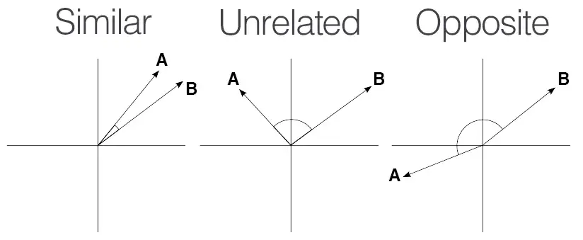
[image ref](https://medium.com/geekculture/cosine-similarity-and-cosine-distance-48eed889a5c4)

- If the angle between two vectors' is 0, the cosine similarity value is 1.<br/>
It means there is a high similarity between them.<br/>
- Else if the angle between two vectors' is 90, the cosine similarity value is 0.<br/>
It means two vectors are independent to each other which means they have no correlation between them.<br/>
- Else if the angle between two vectors' is 180, the cosine similarity value is -1.<br/>
It means two vector has exactly opposite meaning.

It doesn't matter how long the vector is, it just cares about the directionality of the vector.<br/>
As we can see cosine similarity gets from -1 to 1 values. We get similarity between documents by using this.<br/>
In actual, it used only in positive space that results in range 0~1.<br/>
<hr/>

# Basic Statistics

## Data Analysis

When we do Data Analysis, we do EDA(Exploratory Data Analysis) to understand datas and missing datas, and adjusting outliers.<br/>

## Skewness & Kurtosis

### Skewness


[image ref](https://blog.kakaocdn.net/dn/n2GAv/btqGvdEzrac/HLfolQAEN36UbISRKMhWEk/img.jpg) <br/>
__'Skewness'__ is an symmetry of the data distribution.<br/>
It can be a negative, positive or 0 value.<br/>
As you can see,
- positive skewness : right tail is longer than left, ${Mean, Median \gt Mode}$ <br/>
- negative skewness : left tail is longer than right, ${Mean, Median \lt Mode}$ <br/>

And this is the way to understand skewness

- ${-0.5 \lt skewness \lt 0.5}$ : symmetry
- ${-1 \lt skewness \lt -0.5}$ or ${0.5 \lt skewness \lt 1}$ : moderately skewed
- ${skewness \lt -1}$ or ${1 \lt skewness}$: considerably skewed

But when if absolute Skewness value is lower than 3, it considered as a normal distribution.

### Kurtosis


[image ref](https://img1.daumcdn.net/thumb/R1280x0/?scode=mtistory2&fname=https%3A%2F%2Fblog.kakaocdn.net%2Fdn%2FtrZKu%2FbtqGsoAAPjq%2FJXHiEgowgEoBKBbJ29iXM0%2Fimg.jpg) <br/>
__'Kurtosis'__ is a measure of how thick the tail of a probability distribution.<br/>
In other words, it indicates the measure of outliers present in the distribution.<br/>
Since the kurtosis value of the normal distribution is 3, many people base it on 0 that has subtracted 3 from normal distribution's kurtosis.

- Mesokurtic ( ${Kurtosis \approx 3}$ ) : similar to normal distribution's kurtosis.
- Leptokurtic( ${Kurtosis \gt 3}$ ) : It has a longer distribution, and a fatter tail. Because the peak is higher and sharper than Mesokurtic, the data means that the tail is heavy or has many outliers.
- Platykurtic( ${Kurtosis \lt 3}$ ) : It has a shorter distribution, and the tail is thinner than the normal distribution. The peak is lower and wider than Mesokurtic, which means that the data are lighter or lack of outliers.

But when if absolute Kurtosis value is lower than 8 or 10, it considered as a normal distribution.
<hr/>

## Remove outlier

If there are outliers in the data, the model training and statistics might be not result properly.<br/>
So we have to detect it and handle it.<br/>
There are other ways to handle outliers, for example, collect outliers separately, and handle it separately.<br/>
In this time we'll remove it.<br/>
To detect, and remove outlier, we're going to use IQR(InterQuartile Range).<br/>

### IQR(InterQuartile Range)

It simply means ${Q3 - Q1}$.
> ${Q3 - Q1}$ : difference between top 75% and bottom 25% of the data quartile.

And IQR is the basic figure of th Box plot(box-and-whisker plot).<br/>
Let's see this image.

[img ref](https://hong-yp-ml-records.tistory.com/15) <br/>

As you can see, To get IQR value, follow some steps.

1. Find median, if the data length is even, ${M1 + M2 \over 2}$ will be the median.
2. Find the median in the left set of data divided by the median. And it will be the Q1(25th percentile). 
3. Find the median in the right set of data divided by the median. And it will be the Q3(75th percentile).
4. Subtract Q3 and Q1. ANd it will be the IQR.
5. To get lower Whisker(Minimum), subtract ${1.5 * IQR}$ from Q1.
6. To get upper Whisker(Maximum), add ${1.5 * IQR}$ to Q3.
7. And the data not included between the minimum and maximum values are outliers.

It is such an aggressive way to detect outliers. Therefore, before using this, consider carefully whether it is appropriate for your data.<br/>
<hr/>

## cross-tabulation analysis(Chi-sqare test)

__cross-tabulation analysis__ is an analysis technique for checking correlation between two categorical columns.<br/>
This technique find correlations using frequency of datas. And uses the __*chi-square statistics*__ as the test statistics. So It is also called as __*Chi-square test*__.<br/>

As with all analysis, it also has __Null hypothesis__ and __Alternative hypothesis__.<br/>
In Chi square test,
Null hypothesis means each two column has independent values.<br/>
Alternative hypothesis means there are correlation between two columns.<br/>

The result of this analysis, named p-value(probability value) is the discriminating factor.<br/>
If p-value is under 0.05, the Null hypothesis is rejected and the Alternative hypothesis is adopted.<br/>
So It means two columns have correlation each other.

<hr/>

## P-value (probability value)

Let's learn more about p-value.<br/>
Actually the __*p-value*__ is the conditional probability that the observed value or the more extreme value appears through the sample data. On the premise that the null hypothesis is true.<br/>
Simply, It indicate the degree to which the null hypothesis is supported.<br/>
Usually we determine the validity of Null hypothesis with 0.05(5%) or 0.01(1%) of p-value.<br/>
But It doesn't mean the Alternative hypothesis is true. It means only the probability that the Null hypothesis is true.<br/>
Therefore, even if the p-value is 0.05(5%), there is still a possibility that Null hypothesis is true.
So, If It is dangerous to reject the Null hypothesis like determining the efficacy of vaccine, we have to set lower significance level.<br/>
Even if the p-value is low, it is useless if it is not well revealed in the data.<br/>
In other words, the effect of the experiment is more important. It is just a statistical figure, doesn't have practical meaning. So we have to find another way to get better result.<br/>

### p-hacking

To get p-value as we wanted, some people manipulated datas. Because of this, a tendency not to rely too much on p-value spread throughout the academia.<br/>
<hr/>

## Conditional probability

Conditional probability is the probability that another event will occur when a given event occurs.<br/>
If there is two event, S(alive or dead) and T(got treatment or didn't).<br/>
The conditional probability means the probability that the probability of occurrence event B when even A occurred.<br/>
So it means the intersection of A and B.
So Let's see the table.<br/>

|void|survive( ${S}$ )|dead( ${S^c}$ )|
|:---|:---:|:---:|
|treated( ${T}$ )|1,000|9,000|
|didn't( ${T^c}$ )|50|950|

Survival probability if treated, this is the conditional probability. And can be indicated like this.<br/>

$${ { P(S \lvert T) } = {P(S \lvert T) \over P(T)} = {{1,000 \over 11,000} \over {10,000 \over 11,000}} = {1,000 \over 10,000} = 0.1 }$$

As we can see there is difference between just a probability of survive, and survive if treated.<br/>
This is the __*Conditional probability*__.<br/>

<hr/>

## T-test

T-test analyze the difference between the means of the two groups.</br>
And t-test is classified into three depends on two groups' kind.<br/>
- One sample T-test
- Independent T-test
- Paired T-test

### One sample T-test

Comparison the Population's mean and the subgroup of a Population's mean.

- Null hypothesis : No difference between the sample mean and the population mean.
- Alternative hypothesis : There is a significant difference between the sample mean and the population mean.

For example, When we want to compare whole country's test score average, and specific school's test score average, the country is a population and the specific school is a sample group.

### Independent T-test(two sample T-test)

Comparison of the mean of two independent groups.

- Null hypothesis : No difference between two groups' mean.
- Alternative hypothesis : There is a significant difference between two groups' mean.

For example, comparison of averages of the English test score in class 1 and the English test score in class 2.

### Paired T-test

Comparison of the mean of two variables in one group.<br/>
And two variables don't have to be a time-related variable.

- Null hypothesis : No difference between two groups' mean.
- Alternative hypothesis : There is a significant difference between two groups' mean.

For example, comparison of the class 1's middle test's score and final test's score.
<hr/>

## Type 1 error, Type 2 error

- Type 1 error : Although the Null hypothesis is true, it is an error that rejecting the Null hypothesis.
- Type 2 error : Although the Null hypothesis is false, it is an error that adopting the Null hypothesis.
<hr/>

## Analysis of variance (ANOVA)

Contrary to t-test, ANOVA is a statistical testing technique that compares three or more groups' averages.<br/>

### Can't we do t-test several times?

It can bring a result that shows which groups have a significant differences.<br/>
But if we do t-test at several times, the probability of type 1 error will increase.<br/>
That's because, usually the significance level is 0.05(5%), But it will be getting higher and higher when more groups are added. So the probability of make type 1 error will be getting higher too.<br/>

The significance level(SL) is __'⍺'__.<br/>
And the reliability(R) will be (1 - ⍺).<br/>
And then the probability of type 1 error(P) will be 1 - (1 - ⍺).<br/>
If more t-tests, the reliability will be squared again and again.
So this is the formula that indicates increment of the probability of type 1 error.<br/>

- Sl : significance level
- R : reliability
- t : the number of t-test
- P : probability of type 1 error

$${ SL = \alpha }$$

$${ R = 1 - \alpha }$$

$${ P = 1 - R }$$

$${ R_t = (1 - \alpha)^t }$$

$${ P_t = 1 - (1 - \alpha)^t}$$

For example, when we compare 3 groups we have to do t-test three times.<br/>

$${SL = 0.05}$$

$${R = 1 - \alpha = 1 - 0.05 = 0.95}$$

$${t = 3 (A-B, B-C, A-C)}$$

$${P = {1 - (1 - 0.05)^3} = {1 - 0.95^3 \approx 0.14 }}$$

So the probability of type 1 is increasing.<br/>
Accordingly, the reliability will automatically decrease.<br/>

So in this case, we have to do ANOVA test not t-test.<br/>

When if we want to get a result that shows which groups have differences, we can do Post hoc test.<br/>

### Post Hoc tests in ANOVA

There are some techniques in Post Hoc, I'll introduce four major techniques of them.<br/>

- Scheffe : It is the most conservative way, the groups are passively separated and tested. And it is okay even if the number of samples in each group is different.
- Bonferroni : It used when the number of samples in each group is different. The degree to which a group is tested separately is similar to Tukey.
- Tukey : It is used when the number of samples in each group is same. But the smaller the number of samples, the lower the accuracy.
- Duncan : The tendency to test groups separately is strongest. But it doesn't control the probability of type 1 error.

Many people use Scheffe.<br/>

### Types of ANOVA

- One-way ANOVA

Analyze with 1 independent variable and 1 dependent variable.<br/>
For example, significant difference test of exam score according to studying techniques among three or more countries.<br/>
Independent variable is studying technique.


- Two-way ANOVA

Analyze with 2 independent variables and 1 dependent variable.<br/>
For example, significant difference test of weights according to gender and the level of exercise among three or more countries.<br/>
Independent variables are gender and the level of exercise.<br/>


- MANOVA(Multiple ANOVA)

Analyze with 1 or 2 independent variables and 2 dependent variable.<br/>


- ANCOVA(ANlaysis of COVAriance)

Analyze based on specific independent variable, and the others are used as covariates.<br/>
Not covariances, it is covariates.<br/>


[images ref](https://bioinformaticsandme.tistory.com/198)
<hr/>

## Pearson correlation coefficient

It is a commonly used correlation coefficient in numerical columns.<br/>
If we want to test correlation between columns in categorical columns, we can use chi-square test instead.

### feature

- It always has the range of -1 to 1.<br/>
- The closer to -1, the negative correlation, and the closer to 1, the positive correlation.<br/>

Negative correlation means that the higher one column, the lower the other negatively correlated column. And it has the minimum value as -1.<br/>
Positive correlation means the opposite, When the higher one column, the higher the other column with positive correlation too. And it has the maximum value as 1.<br/>

- When the pearson value is 0, there isn't any correlation between two columns.<br/>
- Accordingly, the absolute value means the size of the correlation.<br/>

### Check with the sample data

I'll use the built-in iris flower dataset in seaborn.<br/>
It has the information of sepals, petals, and species.<br/>
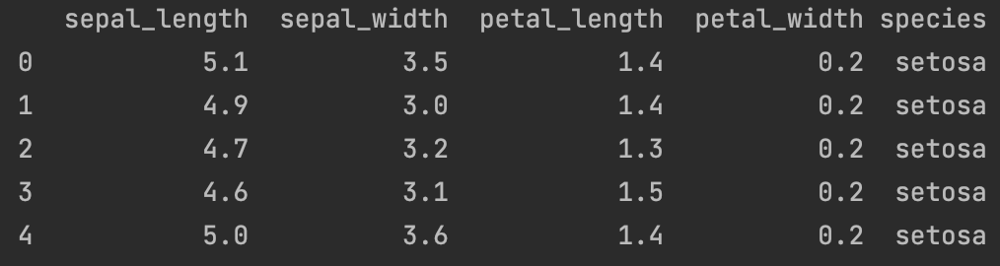

And let's check out the pearson correlation coefficient.
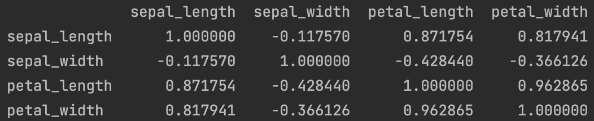

As you can see it returns the correlation coefficient between each column.<br/>

Next, let's check the scatters using `sns.pairplot`.<br/>
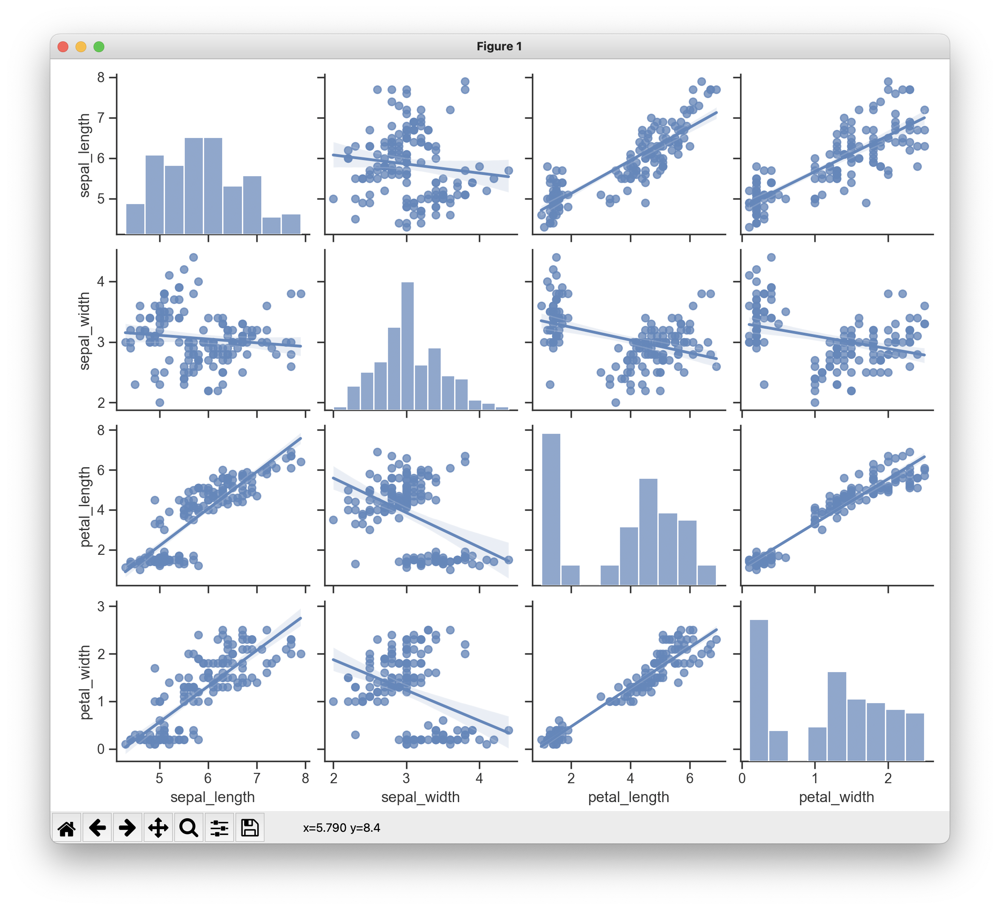

I also added the linear regression line to each scatter plot to see the datas' trend intuitively.
We will except the plots that displays between same column, because it shows just a histogram.<br/>

As we can see it has the tendency of strong positive correlation between petal length and petal width.<br/>
But in the case of sepal width and petal length, although the correlation coefficient and the trends indicates the negative correlation, it doesn't.<br/>
We can understand the datas in the plot that the data can be divided by two, and the first left group has the positive correlation and the other group has the independent relationship.<br/>
It is called as __"Simpson's paradox"__.<br/>
So we have to visualize the scatters plot of the data and check it also.<br/>

If we look at the formula, because it calculate the cosine similarity between each normalized datas, it can be used as a similarity also.<br/>
For example, we can use it in a recommending system.<br/>

### Criteria for determining correlation by correlation coefficient
 
There is some differences in criteria for determining correlation by correlation coefficient among the academias.<br/>
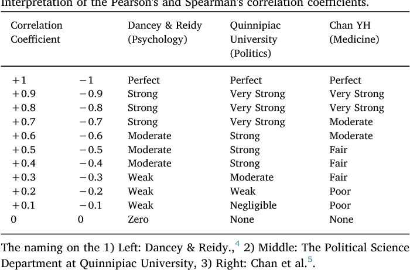

[img src](https://www.semanticscholar.org/paper/User's-guide-to-correlation-coefficients-Ako%C4%9Flu/dd7ceee5b05eb672e850140220f7db44ead3968f) <br/>

Usually we use the Psychology's criteria.<br/>

### Crucial point to understand correlation coefficient


[img src](https://umbum.dev/1006) <br/>

These all have correlation coefficient of 0.82, but those all have different relationship So do not strongly depend on this value, we have to check the visualized dataset also.<br/>
Because the correlation coefficient means just a strength of the linear relationships.<br/>

And there is also the another reason to check the scatters plot named __"simpson's paradox"__
<hr/>

## Simpson's paradox

Actually it is completely unrelated with the animation 'The Simpsons'.<br/>
Simpson is derived from Edward Simpson, a British statistician who summarized this paradox.<br/>


[image ref](https://bioinformaticsandme.tistory.com/117) <br/>

When we check the data as a whole, a certain trend appears, but checking it in a detailed group, the trend disappears or a trend in opposite direction appears.<br/>
This is the __"Simpson's paradox"__.<br/>
<hr/>

## To learn more basic Statistics

Here's two YouTube channels that handles about Statistics.<br/>
[Korean](https://www.youtube.com/channel/UCnN2E8RCEuKi-WLBrd0Nu1A) <br/>
[English](https://www.youtube.com/@statquest)
<hr/>

# Artificial intelligence

## What is AI?

Artificial intelligence (AI), sometimes called machine intelligence, is intelligence demonstrated by machines, in contrast to the natural intelligence displayed by humans and other animals. In computer science AI research is defined as the study of "intelligent agents": any device that perceives its environment and takes actions that maximize its chance of successfully achieving its goals.<br/>
[extracted from here](https://www.toppr.com/ask/question/which-of-the-following-is-a-machine-for-reading-documents-that-are-encoded-in-a-2/)


[source](https://blogs.nvidia.com/blog/2016/07/29/whats-difference-artificial-intelligence-machine-learning-deep-learning-ai/) <br/>
<hr/>

## 3 stages of AI

AI can be broken into 3 stages.<br/>

- ANI(Artificial Narrow Intelligence) or Weak AI

All AI in these days is classified as ANI. It is good at performing only a single task. But it can't take on tasks beyond its field.

- AGI(Artificial General Intelligence)

It is as smart as a human. So it can perform any intellectual tasks. But it can be done far away from now. There is some tests to classify AI as AGI.<br/>

__"Turing test"__ is a test to determine whether the AI can think. 
If human didn't realize that they are having conversation with AI for 5 minutes, the AI can pass the test. 

__"The Coffee test"__ is also a test to determine whether AI can think.
In this test an ai robot is required to go into an average home and figure out how to make coffee. 
It involves finding the coffee machine and adding coffee, as well as sourcing a mug and correctly brewing the hot drink.

- ASI(Artificial Super Intelligence)

It is much smarter than the human being in practically every field.
<hr/>

[3 stages of ai](https://gemmo.ai/the-3-stages-of-ai)

## What is model?

In almost every cases, we can meet models with a function.<br/>
So the model is a function that expresses our datas best.<br/>
Usually expressed as h(x).
<hr/>

## What is Learning?

The process of finding the best model that expresses our datas.<br/>
For some more technically expression, 'learning' is an optimizing process of decreasing loss, cost, error values between real data and predicted data.

### How?

- input datas to initial model
- evaulate the result (accuracy, loss)
- modify the model's type or the parameters(θ: theta) in model.
<hr/>

# Machine Learning

Machine Learning is a comprehensive definition that means __"It is a field of AI that gives computers the ability to learn from data, without being explicitly programmed."__ defined by *Arthur Samuel*.<br/>

## 3 Types of ML


[img src](https://towardsdatascience.com/coding-deep-learning-for-beginners-types-of-machine-learning-b9e651e1ed9d)


### Supervised Learning

Learn from the data has the answer(label, target).<br/>
It can be used in Regression problem with numerical answer value or Classification problem with categorical answer value.

In further description, it learns for predicting the answer for the data.<br/>
According to form of the answers, it can be classified with regression analysis and classification analysis.
These are typical algorithms.
- Linear/Logistic regression
- Decision tree
- Bayesian classification
- Basic Neural Network
- Hidden Markov Model(HMM)

And it can solve these tasks.

- Junk message classification
- Predict stock prices
- Medical diagnosis
- Image recognition

In many cases it brings a better result and makes the problem easy by using classification not regression even if it looks like a regression task.<br/>
We can have the model predict the range by dividing the range of the answer instead of predicting the exact numerical answer.

### Unsupervised Learning

Learn from the data doesn't have the answer(label, target).<br/>
It can be used in Clustering problem or Dimensionality reduction problem.

In further description, it learns for finding the patterns in input datas.<br/>
Therefore, it finds shorter description to express our datas.<br/>
It can solve the __Clustering tasks__ and use __Dimensionality reduction__ to get better result.<br/>
These are typical algorithms.
- K-means clustering
- Nearest Neighbor Clustering
- t-SNE
- EM Clustering
- Principal Component Analysis(PCA)
- Linear Discriminant Analysis(LDA)

And it can solve these tasks.

- Customer group classification
- Association Rule
- Recommendation system
- etc...

### Reinforcement Learning

It has a totally different concept with the other two types.<br/>
It focuses on maximizing the reward, and learns from trial and errors to get the best result.<br/>
In other words, It receives the feedback on the result from taking a lot of different actions(Decision), and learns through whether this action brings the best result(Policy : action-selection policy).<br/>
It can be used in the real-time decisions like game AI.<br/>

Let's see it in order
- It recognizes the __state__ in every sequential steps.
- Takes __action__ that decided in each step.
- Learn the __reward__ received from the __environment__ for the action set.
- Find the action-selection policy that maximize the reward for the every action.

These are typical algorithms.

- Monte Carlo Methods
- Markov Decision Processes
- Q-learning
- Deep Q-learning
- Dynamic programming

And it can solve these tasks.

- Robot control
- Process optimization
- Automated data augmentation

### Additional information

We can combine these model to solve our problems. That means we can combine the different type of models and use to solve the problem.<br/>


[ima src](https://journal.code4lib.org/articles/15660)
<hr/>

## What is Feature, Dimension, Attribute, Column in ML / DL.

- Feature : The independent variable that is a reference column. Feature always means the X data.
- Attribute, Dimension, column : It means X or Y datas. And the Y data means dependent variable that is determined by X data.

The Y data is always expressed as Target and Label. But the Label is used in a classification task.
<hr/>

## How to find the best model?

Using model's __capacity__.<br/>
It is proportional to the model's degree.<br/>

The good model means not only good at with training datas, but also the new datas.<br/>
If the model works well only with the training datas, it is called __overfitting__.<br/>

So the larger the capacity isn't mean the better model performance.
<hr/>

## Overfitting, Underfitting


[img src](https://www.google.com/url?sa=i&url=https%3A%2F%2Fwww.geeksforgeeks.org%2Funderfitting-and-overfitting-in-machine-learning%2F&psig=AOvVaw26-3mpS9ncAsYpuanSAt8W&ust=1671482747632000&source=images&cd=vfe&ved=0CBEQjhxqFwoTCKCH4c-EhPwCFQAAAAAdAAAAABAS)

__Overfitting__ means that the model fits with the training data too much. So it doesn't bring good results with the new datas. It can be called as __Generalization error__.<br/>
__Underfitting__ means the opposite of Overfitting. That means it is not trained enough. So it cannot bring good results with any datas.<br/>


[img src](https://www.google.com/url?sa=i&url=https%3A%2F%2Fvitalflux.com%2Foverfitting-underfitting-concepts-interview-questions%2F&psig=AOvVaw3DljlKhnAbxbDE_1wm6Hk6&ust=1671483202044000&source=images&cd=vfe&ved=0CBEQjhxqFwoTCMi8qaaGhPwCFQAAAAAdAAAAABAJ) <br/>

In this graph the model complexity means anything that makes the model complex like model's capacity, degree, the number of layers, epoch, etc...<br/>
As we can see in the graph, the more complex the model, the lower the training error comes. But the testing error is getting higher at some point. After that point, we can say the model is overfitted. And before that point, we can say the model is underfitted.<br/>

To reduce __Generalization error__, we can use some techniques like dropout, data augmentation,  etc...
<hr/>

## Generalization

We have to generalize our model to avoid overfitting.<br/>
These are the typical generalization techniques.<br/>

### Cross validation

This technique divides the dataset into 3 parts.<br/>

- training data

It accounts for 60%~70% of the datas.<br/>
And we make our model learn only with these datas.<br/>

- validation data

It accounts for 15%~20% of the datas.<br/>
And we tune our model or Hyper Parameters only with these datas.<br/>
In DL, after training finished, we can modify Hyper Parameters or select the best model according to the loss value from validation datas.<br/>
We must not tune our model via the test datas.

- test data

It accounts for 15%~20% of the datas.<br/>
And we only tests our model with these datas.<br/>

Sometimes people divide the dataset as 70% of  training datas and 30% of test datas without validation datas.

But these percentages are not fixed.<br/>
If we have small amount of datas as 100 ~ n*10,000, these can be the best choice.<br/>
But, if we have more than n*100,000 of datas, we can divide as 98 : 1 : 1 or 99 : 0.5 : 0.5.<br/>

There is a representative technique about cross validation named __K-Fold cross validation__.<br/>

#### (stratified)K-Fold cross validation

This image shows the process with one model.


[img src](https://stats.stackexchange.com/questions/338044/what-is-exact-way-to-do-k-fold-validation)

K-Fold cross validation is an algorithm for comparison between selectable models.

1. Shuffle our datas.
2. Divide the datas by 8(training) : 2(test). And it is not fixed.
3. If 10 folds, divide training datas by 10.
4. Train a model with 9 pieces of datas. And validate with the other 1 pieces of datas.
5. Reset the model and train with 9 pieces of datas including that piece which was used as a validation datas in prior training. And also set 1 piece as a validation datas.
6. Iterate these processes(4 ~ 5) 10(K) times.
7. Calculate the average of the results from validation. And this average is this model's performance.
8. Iterate these processes(4 ~ 7) with the other models.
9. Select the best model.
10. Reset the model, and train with whole training datas.
11. Test the model with test datas. And it will be the final result.

People usually use 10 Folds.<br/>

The __stratify__ is used in classification.<br/>
And it can match the total training data's class proportion and the pieces' class proportion.<br/>
For example, the data has 2 classes of 0 and 1.<br/>
It will be good if the proportion is 5 : 5 between the classes, but if the proportion is 90% of class 0 and 10% of class 1, the whole 10% of class 1 datas can be included in a piece of validation datas.<br/>
So __stratify__ matches the proportion of each piece of training and validation datas with the proportion of whole train datas' classes.

### Add Regularization term to the Cost function (Deep Learning)

### Drop out & Batch Normalization (Deep Learning)

### More ways

Get more massive amount of datas(Data augmentation & Test time augmentation) is the best way to generalize models.<br/>
Feature reduction is also good but not recommended.

### Ways to handle class imbalance.

[Tensorflow.org](https://www.tensorflow.org/tutorials/structured_data/imbalanced_data?hl=ko#oversample_the_minority_class) <br/>
[blog](https://3months.tistory.com/414?category=756964)

<hr/>

## Linear Regression(Supervised learning)

Regression analysis technique that modeling linear correlation between one dependent variable(Y) and one or more independent variable(X).<br/>
It can be divided into two types according to the number of X.

- Simple Regression Analysis : one X influences Y.


[src](https://medium.datadriveninvestor.com/machine-learning-101-part-1-24835333d38a)

$${h_\theta(X) = \theta_0 + \theta_1X}$$

- Multivariate Regression Analysis : over 2 amount of X influence Y.


[src](https://www.google.com/url?sa=i&url=https%3A%2F%2Fblog.devgenius.io%2Fmultivariate-linear-regression-dfd18a26431d&psig=AOvVaw17vss2UzqqTGi4xJT_s8s0&ust=1671568693096000&source=images&cd=vfe&ved=0CBEQjhxqFwoTCKjmseXEhvwCFQAAAAAdAAAAABAD)

$${h_\theta(X) = \theta_0 + \theta_1X_1 + \theta_2X_2}$$

For a general expression,

$${h_\theta(X) = \theta_0 + \theta_1X_1 + \theta_2X_2 + \dots + \theta_nX_x}$$

And it can be calle __"linear Combination"__.
<hr/>


## Gradient Descent Algorithm


[img src](https://m.blog.naver.com/sqlmvp/221855713144)

- The way to find optimum thetas that minimize the error value from Cost Function.
- Modifying by subtracting the value that multiplied cost function's gradient and a constant.

So "Gradient Descent" finds the point at which the cost is minimal by stepping down to the lower direction of gradient in Cost Function.<br/>
Determine the direction that decreases the theta by differentiating the cost function at the current theta's location.<br/>
In this process we can get each theta's gradients by doing __partial derivative__.

If the gradient has negative value, the bigger theta, the lower the cost will be.<br/>
On the contrary, if the gradient has positive value, the lower theta, the lower the cost will be.<br/>
So we have to modify theta in the opposite direction of the gradient's symbols.<br/>
And the lowest point in the graph(Global minimum) is our goal that we have to arrive.

Actually Gradient descent is not only for finding optimum theta value, but also for finding the optimum value of any variables that is modifiable and have the criterion that judges the variable like loss.<br/>
So it can be used for finding any optimum values.<br/>

Total process is here.

1. Initialize theta value.
2. Get gradient value in current position.
3. Set the next theta by moving the theta to the gradient direction.
4. Iterate 1 ~ 3 until the value of the cost function converges to a specific value.

And the formula is here.<br/>

$${\theta_j(next) := \theta_j -\alpha{\partial \over \partial\theta_j}J(\theta_0, \theta_1)}$$

- ${\theta_j}$ : current theta value
- ${J(\theta)}$ : Cost Function
- ${\theta_1}$ : weight
- ${\theta_0}$ : bias
- ${\alpha}$ : Hyper Parameter(learning rate)

It works like this.


[img src](https://angeloyeo.github.io/2020/08/16/gradient_descent.html) <br/>

X : Theta<br/>
Y : Cost

This gif indicates the descending process of 1 theta, But in actual, the descending of all theta is brought together.<br/>
So if we have two thetas, we can get this graph.<br/>


[src](https://medium.com/@acb28/implement-linear-regression-using-gradient-descent-9209e45273ce) <br/>

### Learning rate (Alpha)

Alpha is a parameter that we have to set.<br/>
In ML or DL, every parameter that we have to set are called as __Hyper Parameter__ like Learning rate, epoch, etc...<br/>
And the " ${\alpha}$ (step size or learning rate)" means the decrease amount per each step(iteration).<br/>
We have to set it as a proper value or the loss will not converge, or it will diverge.<br/>


[img src](https://www.jeremyjordan.me/nn-learning-rate/) <br/>

The proper value of learning rate will be different at each model.<br/>
Usually we use 0.01 or 0.001 as the learning rate.<br/>
Actually one of the goal of __AutoML__ is finding the best Hyper parameter automatically.<br/>
- Auto HPO(Hyper Parameter Optimization) == Model Tuning
- Auto MS(Model Selection)
- Auto FE(Feature Engineering)

These three thing is the goal of __AutoML__.

### Local minima & Global minimum

Another problem of Gradient descent is __local minima__ problem.<br/>
While the red point(Global minimum) in this image, is our goal, there is some cases that the loss converges to the local minima(yellow point), because the starting point of gradient descent is random every time.<br/>


[img src](https://angeloyeo.github.io/2020/08/16/gradient_descent.html) <br/>

There is some advanced gradient descent to solve this problem.
- Momentum
- NAG
- SGD
- Adagrad
- Adadelta

### Why don't we find the best thetas by using a differential equation?

How about calculating ${{\partial \over \partial \theta}cost(\theta) = 0}$ ?<br/>
That's right!<br/>
There are many ways to find the best thetas.<br/>
And it is just another way to find it.<br/>
But in deep learning, it caused a problem during training.<br/>
During the calculation of this equation, there is a problem of increasing data beyond calculation.<br/>
So we selected gradient descent.<br/>
<hr/>

## Partial derivative

Partial derivative is a derivative for functions with multiple independent variables.<br/>
Using this, we can differentiate based on each independent variable.<br/>
We can differentiate based on a particular variable while considering other variables as constants.<br/>

For example, this is the function.<br/>

$${z = f(X, Y) = X^2 + XY + Y^2}$$

This is the result of partial derivative.<br/>

$${{\partial z \over \partial X} = 2X + Y}$$

$${{\partial z \over \partial Y} = 2Y + X}$$

And if X is 1 and Y is 2, the result will be like this.<br/>

$${{\partial z \over \partial X}(1, 2) = 4}$$

$${{\partial z \over \partial Y}(1, 2) = 5}$$

This is the partial derivative's basic principle.<br/>

## Cost Function

Cost Function is a function for judging the model's performance(accuracy) based on the difference between the real value and the predicted value.

### Mean Squared Error(MSE)

$${J(\theta) = MSE = {1 \over N} \sum_{i=1}^N (y_i - \hat{y_i})^2}$$


[src](https://www.google.com/url?sa=i&url=https%3A%2F%2Fvitalflux.com%2Fmean-square-error-r-squared-which-one-to-use%2F&psig=AOvVaw2gxr6-B472SlpQb-kdU-gy&ust=1671570651803000&source=images&cd=vfe&ved=0CBEQjhxqFwoTCNCLiYvMhvwCFQAAAAAdAAAAABAs) <br/>

It is the most basic and representative cost function.<br/>
For example we have errors list like this. <br/>
[3, -4, 5, -3.2, -0.8]<br/>
The sum of them is 0.<br/>
And then can we say our model works well?
The answer is no. Because there are __errors__ in actual results.<br/>
So we have to __square__(MSE) or absolute(MAE : It used in ML as an indicator for regression evaluation) them to get total costs.<br/>
And we divide it by the amount of datas, we can get the error's absolute __Mean__.<br/>
The closer the value to 0, we can think the model works well.<br/>
That's the reason why it called as Mean Squared Error. It is so intuitive.<br/>

> error == cost == loss

#### Similar to MSE

- MAE(Mean Absolute Error) : Use the absolute errors instead of squared errors.
- MAPE(Mean Absolute Percentage Error) : Use the percentage of the errors.
- RMSE(Root Mean Squared Error) : Because the MSE squared the errors, It takes rooted value to get closer error values to the initial error values.
<hr/>

### Cross Entropy

$${J(\theta) = -\sum_i y^{(i)} \log(h(x^{(i)}))}$$

It is a cost function for classification problem.<br/>
Basically, it calculates the cost by comparing the differences between predicted value's distribution and the real value's distribution.
For more technical expression, It compares predicted which is applied __softmax function__ and the real __one-hot label__ and calculate the distance to move one's distribution to the other's distribution.<br/>
So It always with the __softmax function__.<br/>

It doesn't simply determine whether it is correct or wrong in the classification problems, but how sure got the correct answer and how close the wrong answer to the correct answer is.<br/>
For example, there is two models like this.

<table style="text-align: center">
    <caption>Model 1</caption>
    <tr>
        <td colspan="3">predicted</td>
        <td colspan="3">answer(one-hot vector)</td>
        <td>correct?</td>
    </tr>
    <tr>
        <td style="border-right: 0">0.3</td>
        <td style="border: 0">0.3</td>
        <td style="border-left: 0; font-weight: bold">$$\color{blue}{0.4}$$</td>
        <td style="border-right: 0">0</td>
        <td style="border: 0">0</td>
        <td style="border-left: 0; font-weight: bold">1</td>
        <td>yes</td>
    </tr>
    <tr>
        <td style="border-right: 0">0.3</td>
        <td style="border: 0; font-weight: bold">$$\color{blue}{0.4}$$</td>
        <td style="border-left: 0">0.3</td>
        <td style="border-right: 0">0</td>
        <td style="border: 0; font-weight: bold">1</td>
        <td style="border-left: 0">0</td>
        <td>yes</td>
    </tr>
    <tr>
        <td style="border-right: 0">0.1</td>
        <td style="border: 0">0.2</td>
        <td style="border-left: 0; font-weight: bold">$$\color{red}{0.7}$$</td>
        <td style="border-right: 0; font-weight: bold">1</td>
        <td style="border: 0">0</td>
        <td style="border-left: 0">0</td>
        <td>No</td>
    </tr>
</table>

Classification error = ${{1 \over 3} = 0.33}$

With cross-entropy = ${-(ln(0.4) + ln(0.4) + ln(0.1)) / 3 = 1.38}$

<table style="text-align: center">
    <caption>Model 2</caption>
    <tr>
        <td colspan="3">predicted</td>
        <td colspan="3">answer(one-hot vector)</td>
        <td>correct?</td>
    </tr>
    <tr>
        <td style="border-right: 0">0.1</td>
        <td style="border: 0">0.2</td>
        <td style="border-left: 0; font-weight: bold">$$\color{blue}{0.7}$$</td>
        <td style="border-right: 0">0</td>
        <td style="border: 0">0</td>
        <td style="border-left: 0; font-weight: bold">1</td>
        <td>yes</td>
    </tr>
    <tr>
        <td style="border-right: 0">0.1</td>
        <td style="border: 0; font-weight: bold">$$\color{blue}{0.7}$$</td>
        <td style="border-left: 0">0.2</td>
        <td style="border-right: 0">0</td>
        <td style="border: 0; font-weight: bold">1</td>
        <td style="border-left: 0">0</td>
        <td>yes</td>
    </tr>
    <tr>
        <td style="border-right: 0">0.3</td>
        <td style="border: 0; font-weight: bold">$$\color{red}{0.4}$$</td>
        <td style="border-left: 0">0.3</td>
        <td style="border-right: 0; font-weight: bold">1</td>
        <td style="border: 0">0</td>
        <td style="border-left: 0">0</td>
        <td>No</td>
    </tr>
</table>

Classification error = ${{1 \over 3} = 0.33}$

With cross-entropy = ${-(ln(0.7) + ln(0.7) + ln(0.3)) / 3 = 0.64}$

These two model's classification error is same as 0.33.<br/>
But If calculate the loss with cross-entropy, first one will be 1.38 and the second one will be 0.64.<br/>
Second model's loss is lower than the first one.<br/>
It calculates the degree to which the answer is far from the correct answer, and also the closer to the correct answer is to 0, the exponentially higher the loss.<br/>
So it makes us select model2.<br/>

[more about CE](https://umbum.tistory.com/210)

<hr/>

## Softmax


[src](https://www.google.com/url?sa=i&url=http%3A%2F%2Fm.blog.naver.com%2Ftakion7%2F221625764552&psig=AOvVaw3auiaVlzn5uYP6yRUbYk4N&ust=1672091249022000&source=images&cd=vfe&ved=0CBEQjhxqFwoTCNCXo7vflfwCFQAAAAAdAAAAABAS) <br/>

$${S(y_i) = {e^{y_i} \over \sum\limits_{j=1}^n e^{y_j}}}$$

Softmax is a function for multi-class classification problem.<br/>
It converts the scores(model output) to the vector consist of the probability for each class.<br/>
So it makes the sum of the probabilities of all classes one.<br/>
If with cross-entropy, it can also be called as __softmax with loss__.<br/>
It iss usually used at the output layer in DL. And do the __Backpropagation__ with the loss from it.<br/>

<hr/>

## Logistic Regression(Supervised learning)


[img src](https://www.javatpoint.com/logistic-regression-in-machine-learning)

It's for binary classification problems.<br/>
There are __'k-class logistic regression'__ and __'k-class & ordinal logistic regression'__ as deformed models. For example, spam detection<br/>
__k-class__ is for multiple(3 or more) categories. For example, sports preference.<br/>
__k-class & ordinal__ is for multiple categories and there is a natural ordering among the categories. For example, movie ratings.<br/>

It uses __Sigmoid function__ to calculate the probability that specific data is included in the class. So it can predict the probability, or classify true or false if the value over the cutoff(threshold or decision boundary).<br/>

So logistic regression can return 2 types of results.<br/>
- <predict_proba()> Real probability of 2 classes. It can return probabilities like this [0.32, 0.68]. It means the probability for class0 is 0.32, and 0.68 is for class1.<br/>
- <predict()> Return just 0 or 1 of value. It means false or true. We can also set the cutoff(default: 0.5). So It classifies true or false if the value over the cutoff.<br/>

And it needs another cost function not mse.<br/>
It uses __cross entropy(CE)__ cost function.

<hr/>

## One-hot encoding

It's for only categorical columns.<br/>
It converts numerical categories to vectorized categories.<br/>
In other words, It makes a vector that each index indicates each category.<br/>
And set as true only the corresponding index for each category, and the other indices as false.<br/>


[img src](https://www.dictionary4it.com/term/one-hot-encoding-6577/) <br/>

And also it eliminates the possibility for model to determining that each category has correlation with each other while training.<br/>
So it makes each category works independently.<br/>

For example, If there are categories like [1, 2, 3], computer can think them that they are calculable numeric like 3 = 1 + 2.<br/>
So it converts this to [[1, 0, 0], [0, 1, 0], [0, 0, 1]] called __one-hot label(vector)__.<br/>
So it makes a vectors filled with 0 except one for indicating each category.<br/>
And also it can be used in a string categories.<br/>
If categories are like this ['a', 'b', 'c'], we have to match it as a number.<br/>
['a', 'b', 'c'] => [1, 2, 3]<br/>
After that, do the one-hot encoding, and it'll result [[1, 0, 0], [0, 1, 0], [0, 0, 1]].<br/>
And categories will be matched like this.<br/>
a => [1, 0, 0]<br/>
b => [0, 1, 0]<br/>
c => [0, 0, 1]<br/>
This is one-hot encoding.

It is mandatory in linear models, and usually applied in non-linear models too but no needs in tree-based models.<br/>
<hr/>

## Sigmoid Function


[src](https://towardsdatascience.com/activation-functions-neural-networks-1cbd9f8d91d6)

$${h(x) = p(Class_{(+)} \lvert X) = {1 \over 1 + e^{ax + b}}}$$

It indicates a positive probability in range 0 to 1.<br/>
So we can classify true or false if the value over 0.5 or not.

And it also used in Deep learning as an __activation function__.<br/>
Actually there are more __activation functions__ like Relu, Tanh, Softmax. And these also have deformed shapes.<br/>
<hr/>

## Scikit learn

This is a library for traditional Machine Learning.<br/>

To do ML, follow these processes.<br/>
1. Load dataset

Load datas as a dataframe.

2. Preprocess datas.

Feature scaling for numerical columns using Min-MAX algorithm or Standardization, or One-hot encoding for categorical columns.<br/>

3. Split the data as train, test datas.
4. Generate Model Instance.
5. Model fitting.
6. Predict on test datas to estimate the model performance.
7. Apply to real datas.
<hr/>

## Confusion matrix

Confusion matrix is an evaluation metric for classification.<br/>

<table style="text-align: center">
    <tr>
        <td colspan="2" rowspan="2"></td>
        <td colspan="2">Actual Values</td>
    </tr>
    <tr>
        <td>Positive</td>
        <td>Negative</td>
    </tr>
    <tr>
        <td rowspan="2">Predicted Values</td>
        <td>Positive</td>
        <td>$$\color{blue}{True Positive(TP)}$$</td>
        <td>$$\color{red}{False Positive(FP)}$$</td>
    </tr>
    <tr>
        <td>Negative</td>
        <td>$$\color{red}{False Negative(FN)}$$</td>
        <td>$$\color{blue}{True Negative(TN)}$$</td>
    </tr>
</table>

As we can see, it contains TP, FP, FN, TN values that compares actual values and predicted values to evaluate the model's performance.<br/>
And each factor means
- TP : predict the value as true which is actually true
- FP : predict the value as true which is actually false
- FN : predict the value as false which is actually true
- TN : predict the value as false which is actually false

So TP, TN indicates the number of well predicted values.<br/>
And FP, FN indicates the number of badly predicted values.<br/>

We can get many performance indicators.

1. Accuracy

Accuracy is the ratio that the model predicted well.<br/>

$${Accuracy = {TP + TN \over TP + FP + FN + TN}}$$

It indicates the correct answers only.<br/>
So it can't check the wrong answers deeply.<br/>
When we classify the cancer patient, it's dangerous if the model classify a cancer patient as not a cancer patient.<br/>
So we have to check the wrong answers, and try hard to reduce false negative values.<br/>

2. Precision

Precision is the ratio of the actual positive values among the predicted positive values.<br/>
So it focuses on FP.<br/>
It is an important factor in the classification of the spam mail.<br/>

$${Precision = {TP \over TP + FP}}$$

3. Recall

Recall is the ratio of the predicted positive values among the actual positives.<br/>
So it focuses on FN.<br/>
It is an important factor in the classification of the cancer patient.<br/>

$${Recall = {TP \over {TP + FN}}}$$

4. F1-score

F1-score is a harmonic mean of Precision and Recall.<br/>
So it reflects both two indicators in a balanced manner.<br/>

Contrary to the Accuracy, it is usually used as an evaluation metric in the imbalanced classification problems.<br/>
Also we can use this when if it is ambiguous where to focus between Precision and Recall.<br/>

$${F1-score = {2 * Precision * Recall \over Precision + Recall}}$$

5. F-beta score

Contrary to F1-score, it can give weights to Precision and Recall.<br/>
Actually, F1-score is same with F-beta score that weights is one.<br/>

$${F-beta score = (1 + \beta^2) * {Precision * Recall \over (\beta^2 * Precision) + Recall}}$$

If the beta is bigger than 1.0, it'll focus on Recall more.<br/>
Else if the beta is lower than 1.0, it'll focus on Precision more.<br/>

Although we want to focus on Recall, it is better to set the beta value below 10. Because if the beta value over 10, the result will be similar to that with the original Recall value.<br/>
And although we want to focus on Precision, it is better to set the beta value over 0.01. Because if the beta value is under 0.01, the result will be similar to that with the original Precision value.<br/> 
So 1.5 or 2.0 for focusing on the Recall, and 0.6 or 0.3 for focusing on the Precision is recommended.<br/>

Lastly, if the Precision and the Recall has exactly same value, the result will be same regardless of the beta value.<br/>
<hr/>

## ROC-Curve & AUC


[src](https://bioinformaticsandme.tistory.com/328)

ROC-Curve(Receiver Operating Characteristic Curve) is a measurement graph(Evaluation metric) about the model's classification performance in various thresholds(Cut off, Decision boundary).<br/>
And AUC(Area Under the Curve) is the size of an area under the curve.<br/>

It's for binary classification models.<br/>

ROC uses FPR(False Positive Rate), TPR(True Positive Rate).<br/>

- TPR : The ratio of the value predicted as true among actual true values. ${TP \over TP + FN}$
- FPR : The ratio of the value predicted as true among actual false values. ${FP \over TN + FP}$

The graph shows differences of FPR and TPR according to the threshold.<br/>
And each line indicates the model's performance in various thresholds.<br/>
Because FPR and TPR are in a trade-off relationship, one will be decreased when the other one is increasing.<br/>
Look at the graph.<br/>
By making the model strictly to classify as true(high threshold), if the FPR becomes 0, the TPR becomes 0.5. In other words, it means that only 50% of the actual correct answer can be properly determined when FPR is 0.<br/>
So the closer the graph is to the left-top, the better the model is.<br/>

### How to measure the model's performance with these?

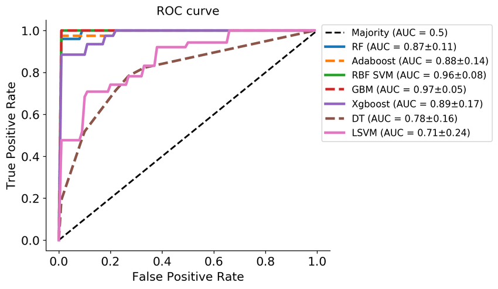

[src](https://www.google.com/url?sa=i&url=https%3A%2F%2Fwww.researchgate.net%2Ffigure%2FROC-curve-AUC-of-05-means-random-guess-and-1-signifies-perfect-classification_fig6_343939033&psig=AOvVaw0qg3qcBcCpTX-73v7uSSFz&ust=1672177609284000&source=images&cd=vfe&ved=0CBEQjhxqFwoTCMC8rpWhmPwCFQAAAAAdAAAAABA8) <br/>

Each graph indicates a different type of model's ROC curve.<br/>
It's difficult to determine which model is the best only with the ROC curves.<br/>
So we use AUC values to determine it.<br/>
In this graph, GBM(Gradient Boosting Machine) is the best classification model.<br/>

The closer the AUC value is to 1, the model is good.<br/>
The closer the AUC value is to 0, the model is bad.<br/>
But actually the minimum value of AUC is 0.5.<br/>
Let's see below descriptions.<br/>
the green and red graph mean actual classes' distribution.<br/>
- AUC = 1


[src](https://bioinformaticsandme.tistory.com/328)

If AUC is 1, each distribution graph doesn't overlap, and the ROC curve is exactly stick to the left-top.<br/>
It means the model can classify the class perfectly.<br/>

- AUC = 0.7


[src](https://bioinformaticsandme.tistory.com/328)

If AUC is 0.7, each distribution graph overlap each other, and there would be type 1 error and type 2 error.<br/>
We can minimize or maximize those errors by modifying the threshold.<br/>
And it means that the model has a 70% probability of properly classifying classes.<br/>

- AUC = 0.5


[src](https://bioinformaticsandme.tistory.com/328)

If AUC is 0.5, the ROC curve will be a straight line.<br/>
It means that the model doesn't have the ability to classify two classes.<br/>

If the AUC value is over 0.78~9, the model is practically useful.<br/>

Actually the ROC curve indicates the cascading graph abstractly.<br/>

Typically, used for the normal person and patient classification problems.<br/>

[more about ROC-Curve & AUC](https://bioinformaticsandme.tistory.com/328) <br/>
[more about ROC-Curve & AUC (2)](https://angeloyeo.github.io/2020/08/05/ROC.html)
<hr/>

## Decision Tree(Supervised learning)

It's an algorithm that we usually use in our daily lives.<br/>

Decision Tree divides the variable area into two at each node(branch).<br/>
And it learns in a direction of increasing the __homogeneity__, decreasing __impurity(uncertainty)__ of each area as much as possible after passing every node.<br/>
In other words, it learns by the direction of decreasing the __entropy(uncertainty)__.<br/>
And it called 'Information gain' in the Information Theory.<br/>
In each node, they divide the data into two. And it is called 'recursive partitioning'.<br/>
And also, when the tree's homogeneity is 100%(__Full tree__), it may occur overfitting because it is too deep.<br/>
So it merges the leaf nodes in a proper levels(__pruning__).<br/>


[src](https://ratsgo.github.io/machine%20learning/2017/03/26/tree/) <br/>

Above image is a sample decision tree algorithm.<br/>
Root node shows whether played the tennis or not during the 14 days.<br/>
And second level's nodes show the climates during the 14 days.<br/>
And in the leaf nodes show whether windy or not and the humidity.<br/>
The real data is this.<br/>

|index|OUTLOOK|HUMIDITY|WINDY|$$\color{red}{PLAY}$$|
|:---:|:---:|:---:|:---:|:---:|
|0|sunny|<= 70|-|$$\color{red}{Play}$$|
|1|sunny|\> 70|-|$$\color{red}{Don't Play}$$|
|2|rain|-|True|$$\color{red}{Don't Play}$$|
|...|...|...|...|$$\color{red}{...}$$|

So Decision Tree is made of these columns.<br/>
It's easy to understand and interpretation, but the structure of tree can be varied greatly even with small fluctuations in input datas like the presence of several outliers, and also easy to overfitting.<br/>
When we use this basic decision tree as a model, the depth of tree will be massively deeper during the training, and there will be only one data in each leaf node.<br/>
It means that there is only one data which is the basis for the model's judgment. And the decision (prediction) becomes unfounded.<br/>
And also it is hard to respond when outliers come as a new input data.<br/>
So it is unstable.<br/>
Due to these weaknesses, the basic decision tree is a little too bad to trust and use.<br/>

So as to solve this problem, [Boosting](https://github.com/Park-SeungWoo/kakao-ai-study#Boosting) upgrade was appeared.<br/>

### More about Decision Tree

[blog](https://ratsgo.github.io/machine%20learning/2017/03/26/tree/) <br/>
[lecture materials(Dongguk univ)](http://bigdata.dongguk.ac.kr/lectures/datascience/_book/%EC%9D%98%EC%82%AC%EA%B2%B0%EC%A0%95%EB%82%98%EB%AC%B4tree-model.html) <br/>
[datascience school](https://datascienceschool.net/03%20machine%20learning/12.01%20%EC%9D%98%EC%82%AC%EA%B2%B0%EC%A0%95%EB%82%98%EB%AC%B4.html) <br/>
[presentation material(Choongbuk univ)](http://contents2.kocw.or.kr/KOCW/document/2017/chungbuk/najonghwa/6.pdf) <br/>
<hr/>

## Model ensemble


[src](https://vitalflux.com/5-common-ensemble-methods-in-machine-learning/) <br/>

It makes several models with datas, and results a final prediction by combining of these all results from every model. So it results by using the strength of each model(making up for each model's weakness).<br/>

So it makes different version of decision trees, and combine(select) their predictions to make final decision.<br/>
In this image models classify the classes, so the final classification is done with majority vote of all results from each model.<br/>
If in the Regression problem, the final result will be the average or a weighted average of all results from each model.<br/>


[src](https://dailyheumsi.tistory.com/111) <br/>

Models in model ensemble technique don't need to be a same model. It can be consisted of Decision Tee, Logistic reg model, SVM, Deep Learning models, etc...<br/>

And there is two representative types of ensemble called Bagging, Boosting.


[src](https://assaeunji.github.io/machine%20learning/2020-08-06-tree/) <br/>

### Boosting

It's one of the representative model ensemble technique that makes weak models as strong models. Published in 1988.<br/>
Contrary to Bagging, it is additive and sequential training technique.<br/>
Additive means that it operates like adding the models.<br/>
And sequential means that it learns one by one, and learn better based on prior results.<br/>
It is just an algorithm that added 'Sequential' and 'Additive' to basic ensemble's idea.<br/>

Typically, Boosting results the best among the ensemble algorithms.<br/>

These are representative Boosting algorithms.
- [AdaBoost](https://github.com/Park-SeungWoo/kakao-ai-study#AdaBoostAdaptive-Boosting)
- [Gradient Boosting Model(GBM)](https://github.com/Park-SeungWoo/kakao-ai-study#Gradient-Boosting-ModelGBM)
- [XGBoost](https://github.com/Park-SeungWoo/kakao-ai-study#XG-Boost-Extreme-Gradient-Boosting)

### Bagging

Bagging is an abbreviation of 'Bootstrap' and 'Aggregating'.<br/>
Contrary to Boosting, it is a parallel training technique.<br/>
Parallel means all weak learners are trained in parallel.<br/>


[src](https://eunsukimme.github.io/ml/2019/11/26/Random-Forest/) <br/>

First, make data samples by bootstrapping(sub-sampling) original data. Usually each sample's size is 63% of the original data's size.<br/> And there can be duplication of the datas. And the number of samples is typically up to us. But it doesn't need to be many, under 50 of samples are recommended.<br/>
Second, make Decision Trees(DT) for each sample.<br/>
Third, train each DT and get results.<br/>
Fourth, combine these results by voting(categorical) or getting average(numerical). And it is the final prediction.<br/>
Finally, get total errors(OOB error: Out Of Bag error) by averaging(or voting) weak learner's errors.<br/>

It doesn't need pruning, because if the model's entropy(instability) is bigger, the performance improvement of the model larger due to bagging.<br/>
If we use Decision Tree as the Base learner, the deeper the tree's depth, the entropy will increase. So the model will be getting more favorable for the Bagging.<br/>

This is a representative Bagging algorithm.
- [Random Forest](https://github.com/Park-SeungWoo/kakao-ai-study#Random-Forest)

### More about Bagging & Boosting

[more about Bagging & Boosting](https://assaeunji.github.io/machine%20learning/2020-08-06-tree/) <br/>
[more about Bagging & Boosting(2)](https://dailyheumsi.tistory.com/111) <br/>
[more about Boosting & Adaboost](https://yngie-c.github.io/machine%20learning/2021/03/20/adaboost/) <br/>
[Bagging & RandomForest](https://todayisbetterthanyesterday.tistory.com/48) <br/>
[Bagging](https://yeong-jin-data-blog.tistory.com/entry/%EC%95%99%EC%83%81%EB%B8%94-%EA%B8%B0%EB%B2%95Ensemble-Method-Bagging-vs-Boosting) <br/>
<hr/>

## AdaBoost(Adaptive Boosting)

It is one of the representative Boosting algorithm.<br/>
And also it is an algorithm based on decision tree(boosted decision tree).<br/>


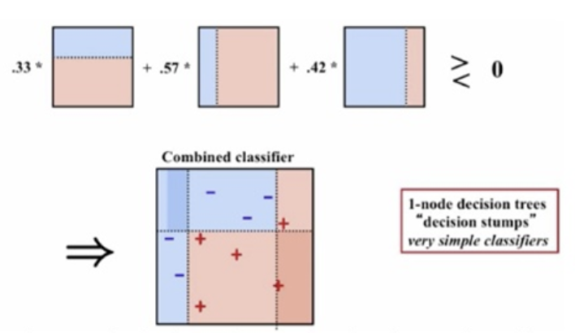

[src](http://www.incodom.kr/Adaboost) <br/>

It repeatedly makes several weak learners(models) based on datas.<br/>
And learn by giving weights(multiply numeric weight to data to classify those datas well) to each badly predicted datas by prior learners(models).<br/>
If all weak learners are finished to train, make the strong learner by combining the results.<br/>
Simply, after counting the number of classes classified by the weak learners for each data, classify each data through majority vote.<br/>
Actually, in order to make the strong learner, we combine the results by giving weights according to each result's(trained model) accuracy to each trained model.<br/>
Finally, proceed final predict using the strong learner.<br/>

AdaBoost uses tree model consisted of two nodes called stump as weak learners.<br/>

But if there is a data point that has a high weight, its performance will decrease dramatically.<br/>
If the one data point has a high weight, it may increase the possibility that occur the misclassification of the other close data points.<br/>
So we have to give the weights to the direction of minimizing the loss.<br/>
Actually, we've ever faced with this problem in Gradient Descent.<br/>
So here comes [__Gradient Boosting__](https://github.com/Park-SeungWoo/kakao-ai-study#Gradient-Boosting-ModelGBM) that added gradient descent to find the optimum weights for datas in AdaBoost.<br/>

### More about AdaBoost

[AdaBoost](https://assaeunji.github.io/machine%20learning/2020-08-14-adaboost/) <br/>
[AdaBoost(1)](http://www.incodom.kr/Adaboost) <br/>
[AdaBoost(2)](https://hyunlee103.tistory.com/25) <br/>
[more about Boosting & Adaboost](https://yngie-c.github.io/machine%20learning/2021/03/20/adaboost/) <br/>
<hr/>

## Gradient Boosting Model(GBM)


[src](https://tyami.github.io/machine%20learning/ensemble-4-boosting-gradient-boosting-regression/) <br/>

It is an advanced version of AdaBoost.<br/>
But I think it's totally different with AdaBoost except the feature of Sequential and Additive.<br/>
First, its weak learner is different with AdaBoost. While AdaBoost's weak learner is a stump, it is consisted of a leaf and restricted trees(i.e. the tree is restricted with maximum number of leaves).<br/>
Second, while AdaBoost predicts the output value, GBM predicts the pseudo-residual(Observed - Predicted) of previous weak learner's predicted probability.<br/>
Third, weights for models(weak learners) is different. AdaBoost gives weights based on their accuracy, but GBM just multiply equally the learning rate.<br/>

Let's check about the total process for classification.<br/>
The left one is for classification and the right one is for regression.<br/>

Classification


Regression


[src](https://tyami.github.io/machine%20learning/ensemble-4-boosting-gradient-boosting-regression/) <br/>

That's it!<br/>
It's simple but checking out the whole flow and studying details is recommended.<br/>

Let's see the formula.<br/>

$${F_t(x) = F_0(x) + \eta \sum\limits_{t=1}^M h_t(x)}$$

Basically it operates by making the weak learners(trees) that predict the pseudo-residual(i.e. to differentiate with residual in linear regression, the term pseudo is added) of previous weak learner's prediction(sequential). And sum the results from weak learners to make final prediction(additive).<br/>
${F_0(x)}$ is the value of the first leaf(i.e just a node in DT). We will see in the example below soon.<br/>

This is the formula in an intuitive version.<br/>


By adding the prediction of the residuals, it'll be getting more descriptive for the datas.<br/>

Just one difference between GBM for regression and for classification is calculation of the probability in classification.<br/>

And also it results the best with tabular format datas.<br/>

Let's see the example!<br/>

In this case I'll use the sample of Titanic datas.<br/>

|P-class|Age|Sex|Survived|
|:---:|:---:|:---:|:---:|
|3|22|M|0|
|1|38|F|1|
|2|26|F|1|
|1|35|F|1|
|3|8|M|0|
|3|27|F|1|

Before start, let's remind this process flow.<br/>
I'll do the classification with these datas.<br/>

1. Create a first leaf
2. Calculate pseudo-residual
3. Create next tree
4. Calculate predicted probability
5. Iterate 2 ~ 4

Let's start!<br/>

1. Create a first leaf

In classification, the first leaf's prediction value is ${log(odds)}$ (target's average in regression).<br/>

> __log(odds)__<br/>
> The odds are the case A's probability of occurrence compared to the probability that Case A will not occur.<br/>
> 
> $${odds = {P(A) \over P(A^c)} = {P(A) \over {1 - P(A)}}}$$
> 
> For example, survived column in the Titanic datas, 4 people are survived, and 2 are not.<br/>
> 
> $${odds = {4 \over 2}}$$
> 
> $${log(odds) = log {4 \over 2} = 0.6931 \approx 0.7}$$

And we have to calculate the probability with this, because it is the classification problem.<br/>

$${Probability = P(A) = {e^{log({P(A) \over P(A^C)})} \over {1 + e^{log({P(A) \over P(A^C)})}}} = {e^{log(odds)} \over {1 + e^{log(odds)}}}}$$

$${P(survived) = {e^{0.7} \over {1 + e^{0.7}}} = 0.6681 \approx 0.7}$$

This case is so exceptional. log(odds) and the probability barely has the same value.<br/>

2. Calculate the pseudo-residual

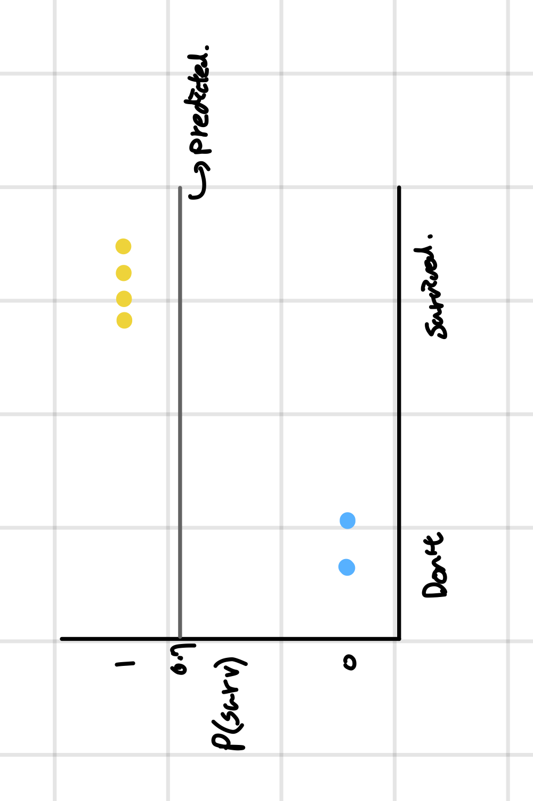

Yellow dots and blue dots indicate each the survived and didn't survive datas.<br/>
And the pseudo-residual(observed - predicted) will be like this.<br/>

|P-class|Age|Sex|Survived|$$\color{red}{residual}$$|
|:---:|:---:|:---:|:---:|:---:|
|3|22|M|0|$$\color{red}{-0.7(0-0.7)}$$|
|1|38|F|1|$$\color{red}{0.3(1-0.7)}$$|
|2|26|F|1|$$\color{red}{0.3(1-0.7)}$$|
|1|35|F|1|$$\color{red}{0.3(1-0.7)}$$|
|3|8|M|0|$$\color{red}{-0.7(0-0.7)}$$|
|3|27|F|1|$$\color{red}{0.3(1-0.7)}$$|

From now on we will focus on the first data to see the change.<br/>
And I'll mark with the blue color.<br/>

3. Create next tree(that predicts the residual of prev)

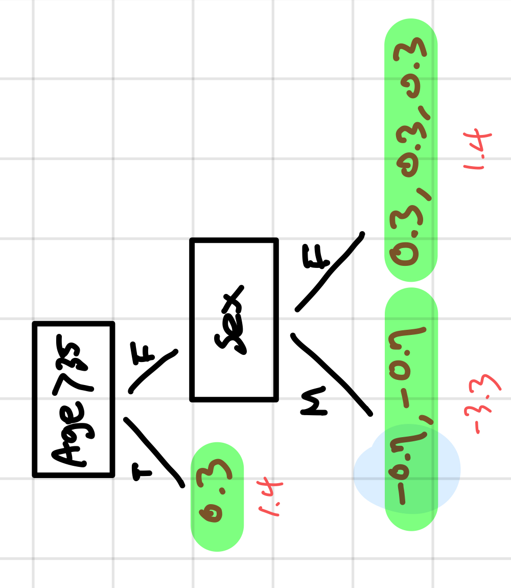

> In this case, I made 3 leaf nodes, but in actual, 8 ~ 32 leaves are recommended.<br/>

Create a tree that predicts the residual of the previous one.<br/>
And the feature selection is also up to computer(by doing simulations each column to find the best one that divided the datas well).<br/>
And the red numbers under the leaves means the representative value of each sample(leaf node). Because all leaf nodes have to result the same value.<br/>
While averaging the values in regression, classification needs more transformations.<br/>

$${\sum Residual \over \sum(previous_probability * (1 - previous_probability))}$$

For the case of second leaf node,<br>

$${ { {(-0.7) + (-0.7)} \over { (0.7 * (1 -0.7)) + (0.7 * (1 -0.7)) } } = -3.3 }$$

4. Calculate the probability of each sample.

For the last step, we have to add this predicted value(residual value) to the previous result.<br/>
Let's apply those -3.3 to the total formula that we saw.<br/>
I'll set the Learning rate as 0.8 to see the change intuitively.<br/>
In actual, people use 0.1 or 0.02 as the Learning rate.<br/>

$${result = 0.7 + (0.8 * -3.3) = -1.94}$$

Because it is the classification, we have to calculate the probability to get the next residual.<br/>
In regression, we can just use the result.<br/>

So, we have to use the probability formula that was used for transforming the log(odds) in the first step.<br/>

$${{e^{-1.94} \over {1 + e^{-1.94}}} \approx 0.1}$$

And I did it for all datas.<br/>

|P-class|Age|Sex|Survived|$$\color{red}{predicted}$$|$$\color{red}{residual}$$|
|:---:|:---:|:---:|:---:|:---:|:---:|
|3|22|M|0|$$\color{red}{0.1}$$|$$\color{red}{-0.1(0-0.1)}$$|
|1|38|F|1|$$\color{red}{0.9}$$|$$\color{red}{0.1(1-0.9)}$$|
|2|26|F|1|$$\color{red}{0.9}$$|$$\color{red}{0.1(1-0.9)}$$|
|1|35|F|1|$$\color{red}{0.9}$$|$$\color{red}{0.1(1-0.9)}$$|
|3|8|M|0|$$\color{red}{0.1}$$|$$\color{red}{-0.1(0-0.1)}$$|
|3|27|F|1|$$\color{red}{0.9}$$|$$\color{red}{0.1(1-0.9)}$$|

Due to the big learning rate, we were able to get the good result from the first iteration, but I'll do it again to see the difference.<br/>

5. Iterate 2 ~ 4

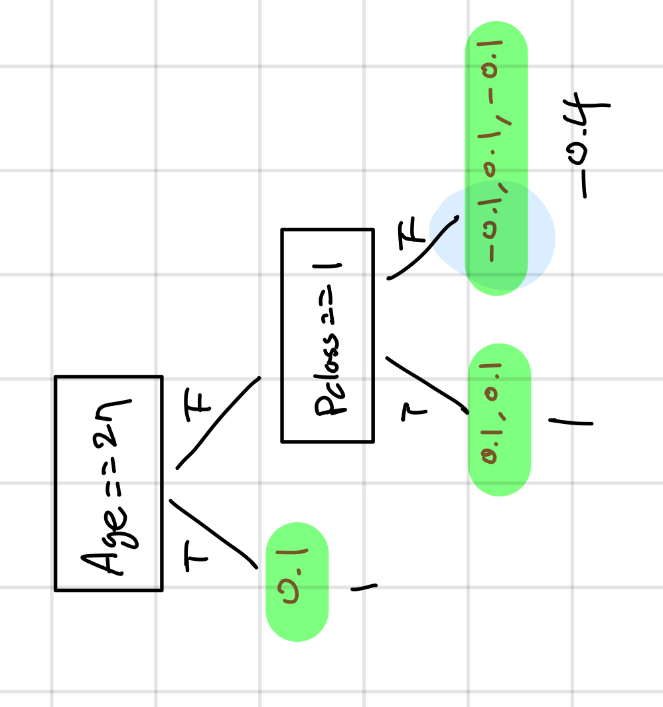

First, get the representative value.<br/>

$${ { (-0.1) + (0.1) + (-0.1) \over (0.1 * (1-0.1)) + (0.9 * (1-0.9)) + (0.1 * (1-0.1)) } = -0.37 \approx -0.4 }$$

And let's see the data we are focusing on(blue marked).<br/>

Second, get total predicted result of it.<br/>

$${0.7 + (0.8*-3.3) + (0.8*-0.4) = -2.26}$$

Lastly, transform it to a predicted probability.<br/>

$${{e^{-2.26} \over {1 + e^{-2.26}}} = 0.09}$$

|P-class|Age|Sex|Survived|$$\color{red}{previous predict}$$|$$\color{red}{current predict}$$|
|:---:|:---:|:---:|:---:|:---:|:---:|
|3|22|M|0|$$\color{red}{0.1}$$|$$\color{red}{0.09}$$|
|1|38|F|1|$$\color{red}{0.9}$$|$$\color{red}{...}$$|
|2|26|F|1|$$\color{red}{0.9}$$|$$\color{red}{...}$$|
|1|35|F|1|$$\color{red}{0.9}$$|$$\color{red}{...}$$|
|3|8|M|0|$$\color{red}{0.1}$$|$$\color{red}{...}$$|
|3|27|F|1|$$\color{red}{0.9}$$|$$\color{red}{...}$$|

So we can see the final result is better than the first one.<br/>

So the prediction is getting closer to the target each time it pass the trees.<br/>
In this case, it learned fast due to the big learning rate.<br/>
When get the final classification, classify it with the basis of threshold(usually 0.5 is used as the threshold).<br/>

But it operates recursively, so it's slow(improved in XGBoost), and it can reduce the bias effectively, but might occur overfitting(use sampling, penalizing to ovoid it).<br/>
When GBM makes new trees, it slows down as it performs many operations.<br/>

> ### bias & variance in ML / DL
> 
> - bias : the average of differences between predicted value and the target value. We can often hear 'the model learns to the direction of reducing the bias'.<br/>
> - variance : the quantity of how much a prediction can change for new data.
> 
> And these two things are in trade-off relationship.<br/>
> 
> - reducing Bias(ovoid underfitting) => increase Variance(the probability of overfitting increases)
> - reducing Variance(avoid overfitting) => increase Bias(the probability of underfitting increases)
> 
> #### Reference
> [bias & variance](https://gaussian37.github.io/machine-learning-concept-bias_and_variance/)

And Here's the total process flow written in my language.

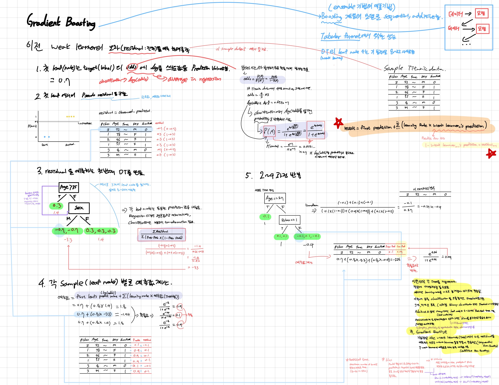

And last, to improve the weakness of GBM, here comes [XGBoost](https://github.com/Park-SeungWoo/kakao-ai-study#XG-Boost-Extreme-Gradient-Boosting) .<br/>
Additionally, there is also the representative upgrade version of GBM called light-GBM.<br/>
Contrary to those all tree-based ensemble algorithms expands the tree horizontally(level-wise), light-GBM expands the tree vertically(leaf-wise).<br/>
So it makes the model faster.<br/>

- leaf-wise(light-GBM)


- level-wise(other tree based ensemble algorithms)


[src for two img](https://nurilee.com/2020/04/03/lightgbm-definition-parameter-tuning/) <br/>

### Reference

[GBM](https://hyoeun-log.tistory.com/entry/ML-Gradient-Boosting-GBM) <br/>
[GBM for classification (en)](https://blog.paperspace.com/gradient-boosting-for-classification/) <br/>
[GBM for classification (ko)](https://tyami.github.io/machine%20learning/ensemble-5-boosting-gradient-boosting-classification/) <br/>
[GBM for regression (ko)](https://tyami.github.io/machine%20learning/ensemble-4-boosting-gradient-boosting-regression/) <br/>

<hr/>

## XG Boost (Extreme Gradient Boosting)

XG Boost is a three times upgraded version of decision tree.<br/>
Each word means each upgrade. It upgraded first with Boosting, second with Gradient Descent, and lastly third with Extreme.
And so on it is also the upgrade version of GBM at the same time.<br/>


[src](https://xgboost.ai/rstats/2016/03/10/xgboost.html) <br/>

This is the representative difference between GB and XGBoost.<br/>
The crucial weakness of the GBM is the speed.<br/>
So as to improve this problem, it applied Parallel Processing Techniques to the GBM.<br/>
It is not for the computation of models like Bagging.<br/>
When making a new tree, it applied Parallel Processing Technique for the calculation of the probability during the process of decision for which feature is the best in every node in the tree.<br/>

But it also has the weakness.<br/>
It needs too many hyper-parameters, so it's hard to find the best combination.<br/>

A lot of winning teams selected this algorithm in competitions like Kaggle, and it won over many neural networks(Deep learning models) because of its flexibility and speed.<br/>
GBM is also well-used.<br/>
<hr/>

## Random Forest


[src](https://medium.com/analytics-vidhya/random-forest-classifier-and-its-hyperparameters-8467bec755f6) <br/>

Random Forest is an algorithm using Bagging.<br/>
So all process is similar with the description in [Bagging](https://github.com/Park-SeungWoo/kakao-ai-study#Bagging) except one major thing.<br/>
The one major difference is that it selects random features also.<br/>
Each datas have features, and the features also selected when bootstrapping. So that make the model avoid overfitting.<br/>
It is also duplicable.<br/>
If there are M of features, people usually select ${\sqrt M}$ of features.<br/>

### Sites About Random Forest

[Random Forest](https://eunsukimme.github.io/ml/2019/11/26/Random-Forest/) <br/>

<hr/>

## Feature importance

### By Coefficient - Linear models

Determine by the weights that were applied to each feature.
Simply higher the absolute of a weight, more its importance is.<br/>
If there are 2 features that each has 0.001 and 1000 of weight.
And we change two features' value at the same degree in order.
the prediction will be changed more with the feature that has a higher absolute value of a weight.<br/>
It means the feature that has 1000 of weight affects more to the prediction.
And when if the weight is similar, the feature whose value is more certain as indicated by its distribution(i.e. close to normal distribution) should be given higher importance.<br/>
But be sure that it can be used under the assumption that the features are normalized.
Because every feature has their own scale, so we have to make them have the same scale.<br/>

### By Coefficient - Tree based models (MDI Importance)

It calculates the importance depending on how much each feature affects the node's branching.<br/>
To know that, we have to know the process of the branching in advance.<br/>
It branches by the direction of decreasing the impurity of the leaf nodes.<br/>
There are 2 representative ways to get impurity.<br/>

#### Entropy

Branch to the direction of maximizing the differences between the entropy that before branched and sum of that after branched on the condition that the impurity after branched is lower than before.<br/>
Simply, Entropy is one of the indicator of impurity like GINI coefficient.

$${Impurity = G(N) = -\sum\limits_{i=0}^k P_i log P_i}$$

- N = node
- K = the number of classes

#### GINI coefficient

GINI coefficient(i.e. GINI index) is originally a statistical index that indicates an income imbalance.
It can compensate for the shortcomings off Lorentz curve that it is difficult to compare when different Lorentz curve intersect.<br/>
Using its formula, we can get GINI impurity.
And also it'll be higher when the datas were distributed evenly.<br/>

$${Impurity = G(N) = 1 - \sum\limits_{i=0}^k P_i^2}$$

- N = node
- K = the number of classes

The tree branches to the direction of minimizing impurity.<br/>

Actually, Entropy and GINI coefficient are for just calculating the impurity, But MDI Importance is the way to get importance using these.<br/>
It calculates the node importance(i.e. information gain in specific node) with using impurity.

$${N's importance = I(N) = w \multiply G(N) - \sum\limits_{i=0}^{the_number_of_child_nodes} w \multiply G(N_i)}$$

- ${w = specific_node's_datas \over total_datas}$

And finally, we can calculate each feature's importance.<br/>

$${feature_importance = \sum\limits_{every_node_branched_by_the_specific_feature} Information_gain \over \sum\limits_{every_node} Information_gain}$$

Before using it, we have to normalize it.

$${normalized_feature_importance = feature_importance \over \sum\limits_{all_feature} feature_importance}$$

Every fitted tree based model has `feature_importances_` that has GINI coefficient based MDI importances in Sklearn.<br/>
Almost all tree based model uses GINI coefficient as a default for getting feature importance.<br/>
But it can't be used as an absolute indicator, because only the GINI coefficient or information gain is considered.<br/>
And also this value was calculated during the training with the train datas, so we don't know how it'll be changed with the test datas.<br/>

### Permutation importance


### Conclusion

Feature Importance can be calculated by these three ways

- MDI Importance
- Permutation Importance
- Drop-column Importance

We have to choose the right method by our circumstance.

### More about feature importance

[MDI & Permutation & Drop-column importance](https://velog.io/@vvakki_/%EB%9E%9C%EB%8D%A4-%ED%8F%AC%EB%A0%88%EC%8A%A4%ED%8A%B8%EC%97%90%EC%84%9C%EC%9D%98-%EB%B3%80%EC%88%98-%EC%A4%91%EC%9A%94%EB%8F%84Variable-Importance-3%EA%B0%80%EC%A7%80) <br/>
[3 ways to get feature importance](https://velog.io/@73syjs/%ED%8A%B9%EC%84%B1-%EC%A4%91%EC%9A%94%EB%8F%84Feature-Importances) <br/>
[feature importance vs permutation importance](https://hwi-doc.tistory.com/entry/Feature-selection-feature-importance-vs-permutation-importance) <br/>
[feature importance for linear & tree based model (+permutation importance)](https://dsbook.tistory.com/361) <br/>
[feature importance for linear model](https://towardsdatascience.com/model-based-feature-importance-d4f6fb2ad403) <br/>
[entropy & gini index (+information gain)](https://process-mining.tistory.com/106) <br/>
[feature importance with gini index (detailed)](https://soohee410.github.io/iml_tree_importance) <br/>
[permutation importance](https://moondol-ai.tistory.com/401) <br/>
[more about feature importance(feature importance for each datas)](https://rfriend.tistory.com/513) <br/>
[correlation & feature importance](https://seungseop.tistory.com/5) <br/>
<hr/>

## R2 score

### ANOVA for regression

#### SST

#### SSE

#### SSR

### Adjusted R squared

### Conclusion

### More about R2 score

[simplified description of R2 score](https://velog.io/@parkchansaem/R2-score결정계수) <br/>
[R2 score](https://math100.tistory.com/120) <br/>
[detailed description of R2 score](https://aliencoder.tistory.com/34#nav1) <br/>

<hr/>

# Information Theory

## Information quantitation

It is the quantity of information that we can 
We can also understand it as a degree of surprising.<br/>


<hr/>

## Entropy

### More about Entropy

[Entropy1](https://angeloyeo.github.io/2020/10/26/information_entropy.html) <br/>
[Entropy2](https://news.samsungdisplay.com/20076) <br/>
[Entropy3](http://www.ktword.co.kr/test/view/view.php?m_temp1=649) <br/>
[Entropy4](https://hyunw.kim/blog/2017/10/14/Entropy.html) <br/>
[Entropy5](https://horizon.kias.re.kr/18474/) <br/>

<hr/>

## Information gain

### More about Information gain

[Information theory with DT](https://stevenoh0908.kro.kr/blog/knowledges/%EC%97%94%ED%8A%B8%EB%A1%9C%ED%94%BC-%EC%A0%95%EB%B3%B4%ED%9A%8D%EB%93%9D%EA%B3%BC-%EB%B6%84%EB%A5%98%ED%8A%B8%EB%A6%AC/) <br/>

<hr/>

## More about Information Theory

[Information quatitation](http://www.ktword.co.kr/test/view/view.php?m_temp1=3660) <br/>
[Basic Information Theory](https://ratsgo.github.io/statistics/2017/09/22/information/) <br/>
[Information Theory](https://brunch.co.kr/@chris-song/68) <br/>

<hr/>

# More sites about datascience

[lecture materials(Dongguk univ)](http://bigdata.dongguk.ac.kr/lectures/datascience/_book/%EC%9D%98%EC%82%AC%EA%B2%B0%EC%A0%95%EB%82%98%EB%AC%B4tree-model.html) <br/>
[datascience school](https://datascienceschool.net/03%20machine%20learning/12.01%20%EC%9D%98%EC%82%AC%EA%B2%B0%EC%A0%95%EB%82%98%EB%AC%B4.html) <br/>